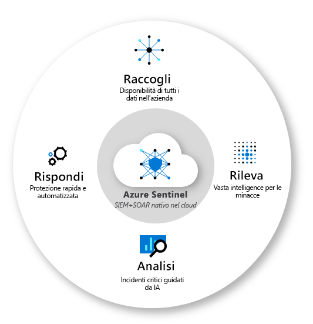

In questi giorni sto costruendo per un cliente una soluzione che, intercettati i Risky Sign-ins di Identity Protection, invia all’utente che ha effettuato l’autenticazione a rischio un’email contenente alcune informazioni e strumenti utili alla verifica in autonomia dell’attività: IP, luogo, tipologia di dispositivo, un link in bella vista che rimanda ai My Sign-Ins.

Gli ingredienti?
- una piccola ma fondamentale configurazione dei Diagnostic Settings di Azure AD
- una query KQL
- Microsoft Sentinel
- Logic Apps e un po’ di conoscenza delle logiche Low Code
- un’utenza di servizio con licenza Exchange Online

Dove non arrivano gli strumenti nativi, avere a disposizione un qualcosa come come Microsoft Sentinel e Logic Apps, che permettono di creare flussi e automazioni limitati solo dalla fantasia, fa tutta la differenza.

Se vuoi approfondire cosa sia e come funzioni Microsoft Sentinel, ti rinfresco la memoria con un articolo di qualche tempo fa.

- [Come capire Microsoft Sentinel in 5 passaggi](/come-capire-azure-sentinel-in-5-passaggi/)

E tu che tipo di automazioni hai sperimentato con Azure Sentinel? Parliamone insieme sui miei social!

Il tuo IT Specialist, Riccardo