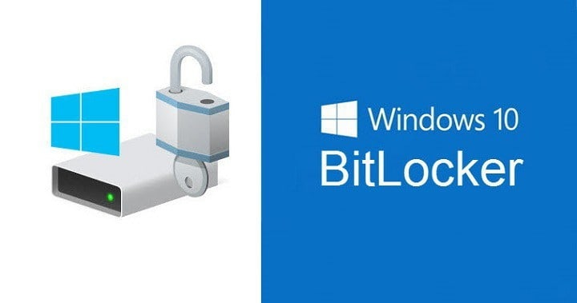

L’impostazione e la distribuzione di Bitlocker attraverso Active Directory è una configurazione che si trova molto spesso nelle infrastrutture dei clienti: basta impostare le GPO ad-hoc e il gioco è fatto! Mmmmmm… diciamo che la maggior parte delle volte è così ma, talvolta, qualcosa può andare storto, specialmente in uno scenario dove i client sono stati (o sono tuttora) lontani per giorni, settimane, a volte mesi dalla rete aziendale e quindi dai domain controller.

Partendo dalla premessa che ogni scenario ha le sue peculiarità e sfaccettature e quindi non mi è possibile analizzarle tutte in un articolo di blog, diciamo che, in generale, ogni buona implementazione di Bitlocker tramite GPO di Active Directory prevede almeno queste due impostazioni:
- il client deve fare automaticamente e autonomamente il backup della recovery key in AD;
- la cifratura del disco non deve mai e poi mai partire se prima non si è eseguito il backup della chiave.

Hai già verificato le GPO in AD e, sulla carta, tutto torna? Perfetto, ma se per caso qualcosa andasse storto e il client fosse un po’ “pigro” nell’effettuare il backup? Oppure, cosa succede se, per un qualunque motivo, si è attivato il Bitlocker prima di joinare il client a dominio?

Niente paura, è possibile dargli una spintarella via PowerShell tramite alcuni cmdlet che ho raccolto per te direttamente dalla documentazione Microsoft:

    BitLocker = Get-BitLockerVolume -MountPoint $env:SystemDrive
    $RecoveryProtector = $BitLocker.KeyProtector | Where-Object { $_.KeyProtectorType -eq 'RecoveryPassword' }

    Backup-BitLockerKeyProtector -MountPoint $env:SystemDrive -KeyProtectorId $RecoveryProtector.KeyProtectorID

Ecco la fonte: [BitLocker and Active Directory Domain Services (AD DS) FAQ (Windows 10) – Windows security | Microsoft Docs](https://docs.microsoft.com/en-us/windows/security/information-protection/bitlocker/bitlocker-and-adds-faq#what-if-bitlocker-is-enabled-on-a-computer-before-the-computer-has-joined-the-domain-)

***Nota***: il backup della chiave di recovery può essere fatto anche su Azure AD, è sufficiente sostituire l’ultimo comando visto poco sopra con la sua versione cloud:

    BackupToAAD-BitLockerKeyProtector-BitLockerKeyProtector -MountPoint $env:SystemDrive -KeyProtectorId $RecoveryProtector.KeyProtectorID

Come usare questi cmdlet?
- se non hai molti client impattati dal problema, puoi eseguirli in remoto manualmente o in sessione interattiva con l’utente;
- molto meglio, eventualmente, costruirci attorno uno script con una gestione degli errori ragionata e distribuirlo attraverso un qualunque tool di management.

Vuoi saperne di più su Bitlocker? Come sempre, ecco un po' di documentazione:

- [BitLocker FAQ (Windows 10) – Windows security | Microsoft Docs](https://docs.microsoft.com/en-us/windows/security/information-protection/bitlocker/bitlocker-frequently-asked-questions)

E a te, è mai capitato di avere un Bitlocker pigro? Come hai risolto la situazione? Ti aspetto sui miei social per parlarne insieme!

Il tuo IT Specialist, Riccardo

