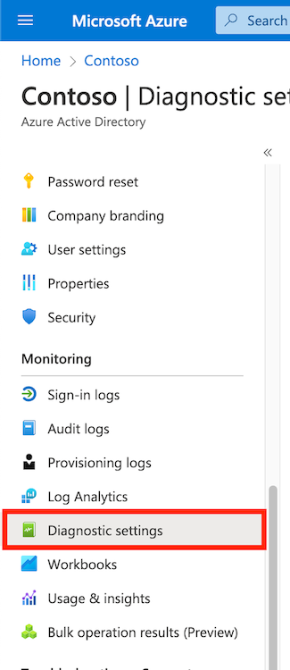
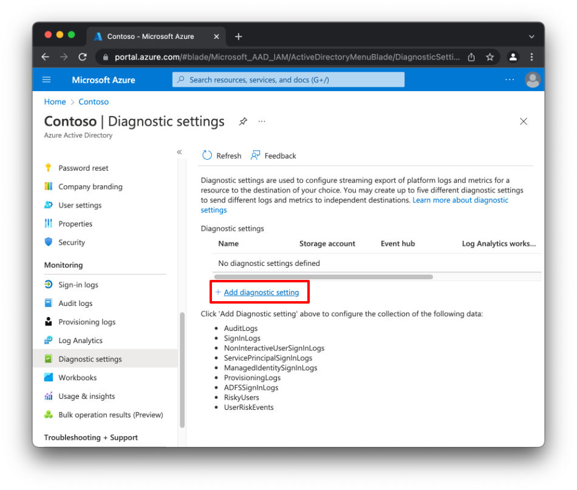
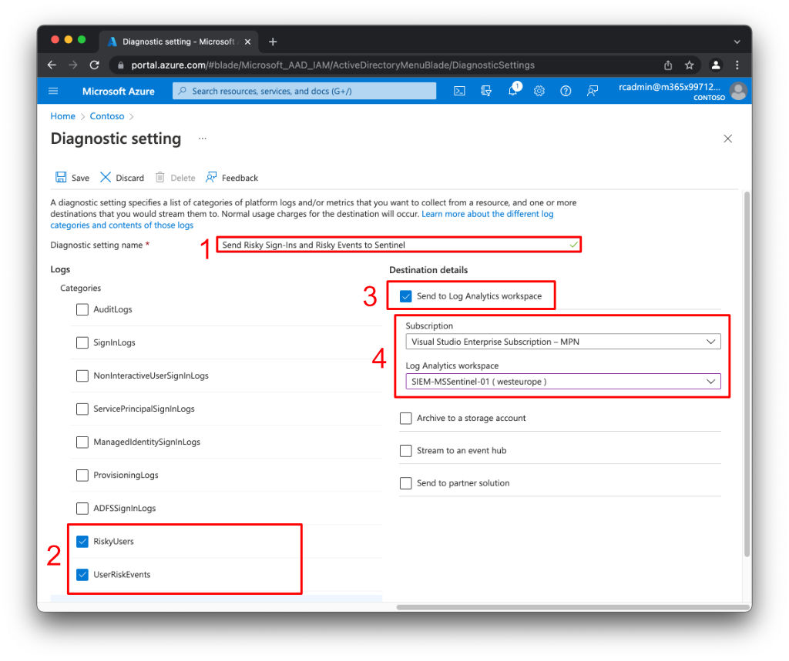
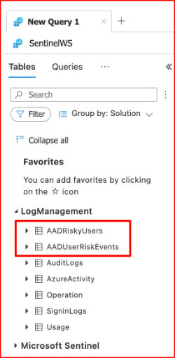
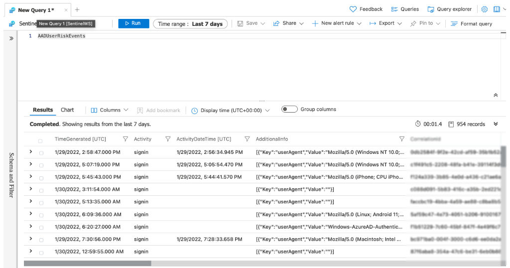

Cosa succederebbe se fossimo in grado di unire la ricchezza dei log di Azure AD Identity Protection, con i suoi eventi di Risky Sign-In e i dati sui Risky Users, ad un ulteriore strumento di analisi con cui scatenare, al bisogno, allarmi ed eventuali automazioni di reazione e remediation? Semplice: avremmo in mano un’arma potentissima contro qualunque minaccia alle identità! Vediamo gli ingredienti di questa integrazione.

## Azure AD Identity Protection: Risky Sign-Ins e Risky Events

Il rilevamento del rischio in Azure AD Identity Protection è una funzionalità utilissima attraverso cui, analizzando alcuni segnali, è possibile stabilire la probabilità che un’utenza o un’autenticazione siano a rischio. Ne ho parlato super-approfonditamente in questo articolo: [Azure AD Identity Protection: cos’è il rischio in Azure AD?](/azure-ad-identity-protection-rischio/)

## Microsoft Sentinel
Microsoft Sentinel è una soluzione per la gestione di informazioni ed eventi di sicurezza (in poche parole un SIEM: Security Orchestration, Automation, and Response). Attraverso opportuni connettori e query in linguaggio KQL (Kusto Query Language), è possibile andare ad interrogare in maniera molto granulare una grande quantità di log memorizzati dalle varie sorgenti dati a cui Sentinel si aggancia. Inoltre, è possibile impostare delle automazioni di reazione in caso di bisogno. Anche di questo ho parlato in un mio articolo di qualche tempo fa: [Come capire Microsoft Sentinel in 5 passaggi](/come-capire-azure-sentinel-in-5-passaggi/).

## Perché integrare le due cose?
Perfetto, ora è il momento di fare 1+1: se riuscissi a “redirigere” la ricchissima raccolta di segnali e quant’altro che viene fatta da Azure AD Identity Protection a Microsoft Sentinel, saresti in grado di interrogare in maniera super-granulare questi log attraverso delle query KQL mirate e completamente personalizzabili in base alle esigenze.

Queste query potrebbero essere usate all’interno di un’Analytics Rule, scatenare un allarme e, di conseguenza, un’eventuale automazione attraverso un Playbook, come ad esempio bloccare un utente, inviare mail o messaggi via Teams al SOC di turno, bloccare un IP, e via dicendo. Il limite è solo la fantasia!

Insomma, come dicevo anche ad inizio articolo: avresti a disposizione un’arma potentissima contro eventuali minacce e attacchi portati alle identità.

## Perché non è sufficiente l’analytics rule built-in di Identity Protection?
Fermi tutti! Ti starai chiedendo:

> *"Rick, ma esiste già un data connector integrato per Azure AD Identity Protection e un’analytics rule built-in che è solo da accendere: perché non basta?"*

Prima di andare avanti, ti racconto perché non mi piace tantissimo l’analytics rule built-in *"Create incidents based on Azure Active Directory Identity Protection alerts"* del connettore di Identity Protection. **Pur essendo utile attivarla, raccoglie i dati in maniera poco uniforme in ottica di automazione**, perché in alcuni casi i Risky Events sono raggruppati e così anche le entità coinvolte negli alert e negli incident. **Insomma, non sono allarmi/incident facili da "setacciare" con un Playbook** perché ogni alert/incident può contenere informazioni e dati differenti, rendendo quindi difficilmente prevedibile e uniforme il formato stesso dell’alert/incident.

**Per scatenare un’automazione, bisogna essere assolutamente sicuri che i dati siano sempre gli stessi e che siano formati e strutturati in maniera identica, possibilmente uno per ogni evento.**

Come si ottiene questo? Scrivendo delle query KQL granulari che estraggano i dati nella maniera che noi vogliamo: è l’unico modo per avere il controllo completo dei dati!

Perfetto: finita questa lunghissima premessa (se sei ancora qui a leggere ti ringrazio 😃), ora affrontiamo davvero l’argomento dell’articolo: inviamo i dati grezzi dei Risky Sign-Ins e dei Risky Events da Azure AD Identity Protection a Microsoft Sentinel!

## Come si fa a mettere a disposizione questi dati da Identity Protection a Microsoft Sentinel?
È molto più semplice di quanto immagini: attraverso una nuova funzione introdotta da poco nei Diagnostic Settings di Azure AD, è possibile in pochissimi clic inviare alcuni log direttamente a Microsoft Sentinel, letteralmente facendone uno “straming” diretto.

Per impostare questo settaggio, vai sul portale di Azure (https://portal.azure.com) e naviga fino alla seguente sezione:
- **Azure Active Directory** –> **Diagnostic Settings** (si trova più in basso, nella sezione "Monitoring")

Nella blade che si apre, clicca la voce **Add diagnostic setting**

Perfetto, ora è sufficiente configurare le impostazioni come segue:

1. dai un nome allo streaming;
2. seleziona i dati da inviare da Identity Protection a Microsoft Sentinel (RiskyEvents e UserRiskEvents);
3. seleziona la spunta Send to Log Analytics workspace;
4. completa la configurazione scegliendo la sottoscrizione Azure e il log analytics workspace corrispondente alla tua istanza di Microsoft Sentinel.

Come verificare che la configurazione sta funzionando? Dopo qualche decina di minuti, tra le tabelle di dati disponibili sul Log Analytics workspace, compariranno queste due voci:

Che dici, proviamo a fare un paio di query per capire quali informazioni è possibile ricavare?

## Query KQL di esempio sui Risky Sign-Ins

Vediamo, ad esempio, quali sono le tipologie di Risky Event più ricorrenti con la query:

    AADUserRiskEvents
    | summarize count()by RiskEventType
    | render piechart

Oppure, è possibile vederli come elenco, ricavando alcune preziose informazioni come:
- l’utente coinvolto nell’evento rischioso;
- il suo indirizzo IP;
- che browser o applicazione stava usando quando si è autenticato;
- livello di rischio;
- descrizione del perché l’autenticazione è stata considerata rischiosa.

Vediamo ora se ci sono utenti considerati a rischio da Azure AD.

## Query di esempio Risky Users
Interroga la data table in questo modo:

    AADRiskyUsers

Ecco i risultati.

Anche questi log sono ricchissimi di informazioni.

## Un ulteriore step verso la magia
Ed ecco la vera magia, il motivo per cui attivare lo streaming degli eventi da Identity Protection a Microsoft Sentinel è davvero un’arma potente: incrociando opportunamente queste data table con altre table, come ad esempio, **SecurityAlert**, **SigninLogs** e **AuditLogs**, attraverso una query KQL e qualche join è possibile ricavare informazioni come:
- UPN dell’utente coinvolto nell’evento a rischio;
- browser o app che stava utiulizzando per fare l’autenticazione;
- tipologia di dispositivo da cui l’autenticazione è stata fatta;
- indirizzo IP;
- livello di rischio;
- motivo per cui l’evento e l’utente sono stati calcolati come “a rischio”;
- location geografica dell’evento: città e paese.

Immagina ora di usare questa query per innescare un alert o un incident che, a sua volta, innesca un’automazione via Playbook: potresti bloccare l’utente, l’IP e, contemporaneamente, avvisare il SOC via Teams o via mail in tempo reale, magari inviando anche un’email all’utente finale.

Quello sopra era solo un esempio: come vedi il limite è la fantasia ed è veramente possibile ricostruire in maniera super-dettagliata il contesto di evento a rischio.

## Licensing per attivare lo streaming dei log di Azure AD verso Log Analytics Workspace
Per fare ingestion dei sign-log su Microsoft Sentinel, è necessaria una licenza **Azure AD Premium P1** o **P2**.

- [Connect Azure Active Directory data to Microsoft Sentinel | Microsoft Docs](https://docs.microsoft.com/en-us/azure/sentinel/connect-azure-active-directory#prerequisites)

Per Identity Protection e, quindi, per avere i dati di Risky Sign-Ins e Risky Users è necessaria una licenza **Azure AD Premium P2**.

Come sempre, se vuoi approfondire ulteriormente l’argomento, ecco altra documentazione utile:

- [Stream Azure Active Directory logs to Azure Monitor logs | Microsoft Docs](https://docs.microsoft.com/en-us/azure/active-directory/reports-monitoring/howto-integrate-activity-logs-with-log-analytics)

Un ringraziamento a [Stefano Pescosolido](https://www.linkedin.com/in/stefanopescosolido/) di Microsoft per le utili integrazioni che mi ha fornito sul licensing di questa funzionalità.

## Conclusioni
Articolo lungo per una configurazione che, tutto sommato, richiede meno di una decina di click. Quello che però era più importante per me era trasmetterti il motivo per cui questo settaggio è davvero fondamentale per trarre il meglio dall'integrazione tra Identity Protection e Microsoft Sentinel. Spero di avertelo raccontato in maniera completa e chiara.

E tu, usi queste funzionalità? Ti aspetto nei commenti per parlare insieme di Identity Protection e Sentinel! A presto!

Il tuo IT Specialist, Riccardo