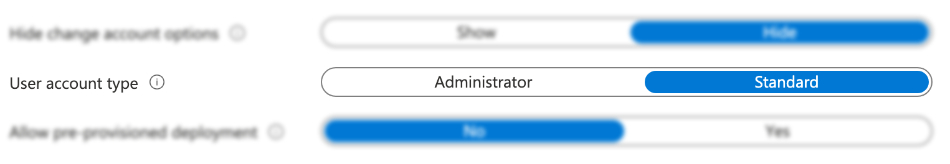
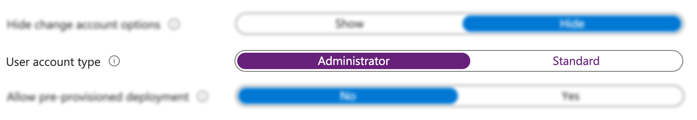
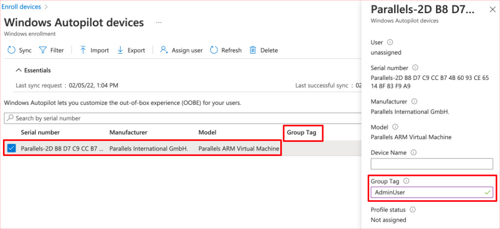
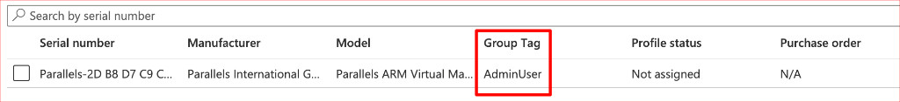
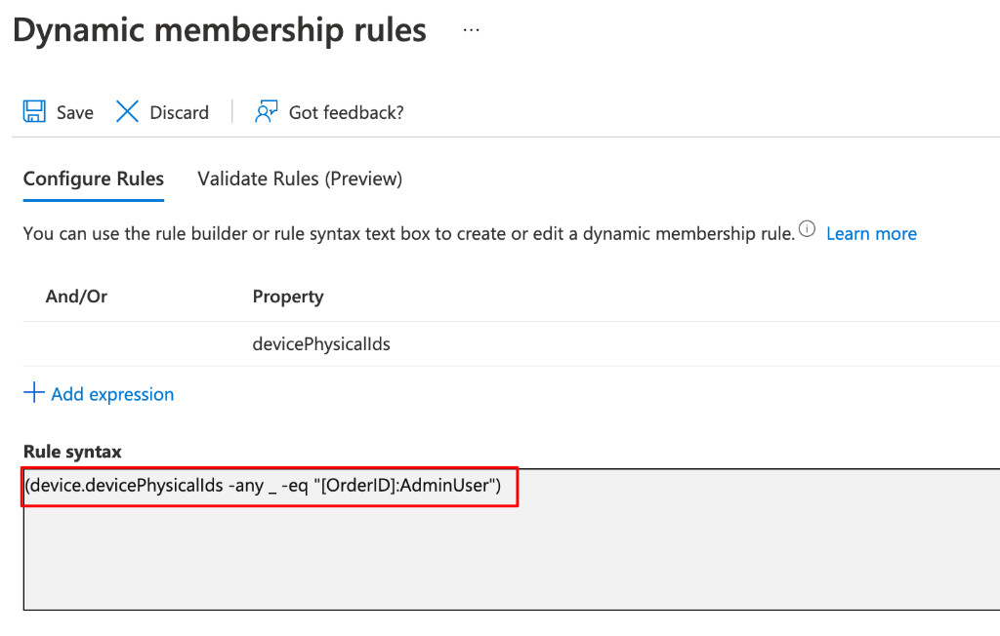
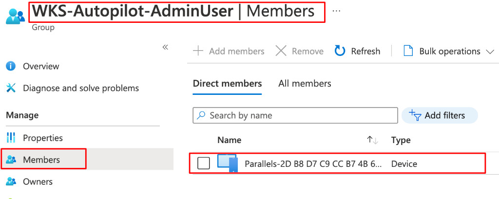
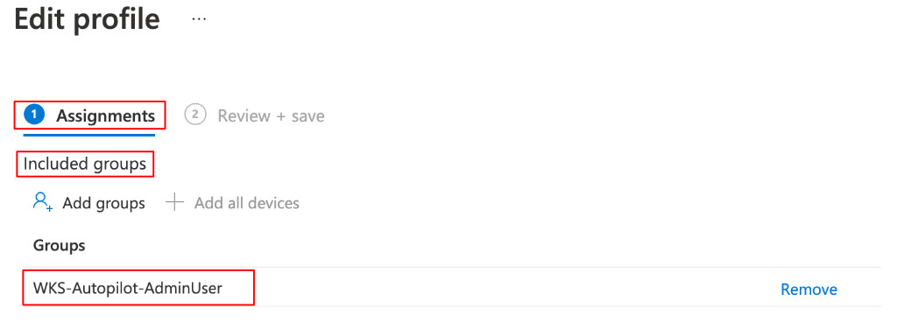

Per un’attività che sto seguendo in queste settimane, ho dovuto aguzzare l’ingegno per trovare una soluzione ad un’esigenza particolare. In un deployment Windows Autopilot, il cliente aveva bisogno di differenziare la distribuzione in questo modo: qualcuno doveva essere amministratore del proprio PC, qualcun altro no. Come indirizzare questa richiesta? Con i group tags! Ora ti racconto.

## Riassunto dello scenario
Per completezza, ecco tutti gli elementi dello scenario:
- i PC vengono distribuiti con Windows Autopilot;
- il cliente ha chiesto di non differenziare per dipartimento, ruolo o altro il parco macchine, perché la baseline di software e configurazioni è sostanzialmente identica tra tutti;
- tutte le macchine di tutti gli utenti vengono joinate ad Azure AD;
- alcuni utenti dovranno essere amministratori dei loro PC;
- altri utenti dovranno avere privilegi standard.

## Step 1: crea due profili di distribuzione di Windows Autopilot
Anche se ritengo che questa pratica verrà superata presto, dopo l’annuncio della possibilità di poter [aggiungere/rimuovere amministratori locali attraverso i profili di configurazione](/configurazione-dei-gruppi-locali-microsoft-endpoint-manager/), al momento esiste un solo modo per far sì che, immediatamente al deployment del PC, si possa decidere che l’utente è amministratore o no: **creare due diversi profili di distribuzione di Windows Autopilot**.

Ecco la configurazione da impostare sul portale di Microsoft Endpoint Manager nella blade:
- **Devices** –> **Enroll devices** –> **Windows Autopilot deployment profiles**

Un profilo, chiamalo per comodità **Autopilot StandardUser**, sarà impostato con Standard alla voce User account Type.

L’altro profilo, che chiamerai ad esempio Autopilot AdminUser, avrà invece questa configurazione.

Perfetto! Ora però... sorge un problema: i due profili di Autopilot vanno assegnati a gruppi di dispositivi diversi. Nel grande calderone dei dispositivi importati in Autopilot col file CSV, come si fa a differenziarli in modo da assegnarne una parte ad un gruppo e una parte ad un altro? È proprio su questo punto che ti vengono in aiuto due ingredienti fondamentali:
- i Windows Autopilot **Group Tags**;
- i gruppi dinamici di Azure AD.

## Step 2: assegna i Windows Autopilot Group Tags ai dispositivi importati
Il group tag è una semplice etichetta che è possibile impostare sui dispositivi Autopilot, in una colonna apposita. Questo campo può essere valorizzato in due modi, totalmente intercambiabili ed equivalenti:
- una volta già importato il file CSV, puoi editare direttamente il Group Tag cliccando su un dispositivo tra quelli di Autopilot (più comodo se devi aggiungere/modificare il valore singolarmente o per poche macchine)

- oppure, puoi fare tutto a monte ed editando il file CSV con Excel e aggiungendo il campo Group Tag su tutti i dispositivi (più comodo farlo così se devi fare un import massivo).

Bene, che tu l’abbia fatto da CSV o direttamente sul portale, il risultato finale sarà il seguente.

***Nota***: *purtroppo avevo a disposizione solo una macchina in Autopilot al momento della scrittura dell’articolo. Nello scenario reale, immagina di avere a schermo un elenco molto più corposo di PC: per ognuno di loro dovrai impostare i Windows Autopilot Group Tags.*

Fantastico! E ora, avanti con lo step successivo, anche questo piuttosto semplice: creerai due gruppi dinamici di Azure AD.

## Step 3: crea i gruppi dinamici in Azure AD sulla base dei Windows Autopilot Group Tags
Ora creerai due security group di Azure AD di tipologia Dynamic Device: questo è il segreto per intercettare, all’interno del calderone di PC Autopilot, quelli che verranno assegnati al profilo Autopilot StandardUser da quelli che verranno assegnati al profilo Autopilot AdminUser! Chiamali, per comodità e chiarezza, WKS-Autopilot-StandardUser e WKS-Autopilot-AdminUser

Ed ecco la query dinamica per ogni gruppo.

Per il gruppo **WKS-Autopilot-StandardUser**:

    (device.devicePhysicalIds -any _ -eq "[OrderID]:StandardUser")

Mentre per il gruppo **WKS-Autopilot-AdminUser**:

    (device.devicePhysicalIds -any _ -eq "[OrderID]:AdminUser")

Ecco un esempio di quello che vedrai a portale.

Hai riconosciuto i Group Tags? Nelle query dinamiche sono mappati con la dicitura **OrderID**.

Dopo qualche minuto, vedrai il gruppo popolato con tutti i dispositivi Autopilot che hanno quello specifico Group Tag!

## Step 4: assegna i dynamic device group ai rispettivi profili di distribuzione Autopilot
Ora torna sulla configurazione di Autopilot e, per ogni profilo creato, assegnagli il rispettivo gruppo.

Finito! Non è stato così complesso, visto?

## Conclusioni
Tanti passaggi, vero, ma piuttosto semplici. I Windows Autopilot Group Tags sono molto comodi per indirizzare l’esigenza di differenziare i dispositivi.

Il fatto di differenziare i profili con AdminUser e StandardUser è stato fatto a scopo puramente didattico. In realtà, potresti valorizzare l’attributo GroupTag con (ad esempio) i dipartimenti (Sales, Marketing, eccetera). Il concetto non cambia.

Ultima nota: qualche giorno prima che pubblicassi questo articolo, è stata annunciata una nuova funzionalità di Microsoft Endpoint Manager attraverso la quale è possibile [aggiungere o rimuovere gruppi e utenze tra gli amministratori locali di un PC](/configurazione-dei-gruppi-locali-microsoft-endpoint-manager/). Personalmente ritengo che, grazie a questa nuova funzionalità, potrebbe essere più semplice e flessibile pensare a dei profili Windows Autopilot che siano sempre Standard User, delegando alle policy di Endpoint Security e Account Protection il resto. Resta però il fatto che, finché questa nuova funzionalità è in anteprima, l’unico metodo “ufficiale” e testato per gli ambienti di produzione per impostare un amministratore locale di macchina o meno fin dalla fase di deployment, è quello descritto in questo articolo.

Vuoi saperne di più? Ecco un po’ di documentazione utile:
- [Support Tip: Using group tags to import devices into Intune with Autopilot – Microsoft Tech Community](https://techcommunity.microsoft.com/t5/intune-customer-success/support-tip-using-group-tags-to-import-devices-into-intune-with/ba-p/815336)
- [Create device groups for Windows Autopilot – Microsoft Intune – Microsoft Intune | Microsoft Docs](https://docs.microsoft.com/en-us/mem/autopilot/enrollment-autopilot#create-an-autopilot-deployment-profile)
- [New settings available to configure local user group membership in endpoint security – Microsoft Tech Community](https://techcommunity.microsoft.com/t5/intune-customer-success/new-settings-available-to-configure-local-user-group-membership/ba-p/3093207)
- [Manage account protection settings with endpoint security policies in Microsoft Intune | Microsoft Docs](https://docs.microsoft.com/en-us/mem/intune/protect/endpoint-security-account-protection-policy)

Grazie per avermi seguito fino a qui, come sempre.

E tu, hai mai usato i Group Tags? Se sì, li hai usati a questo scopo o per altro? Ti aspetto sui miei social per parlarne insieme!

Il tuo IT Specialist, Riccardo
