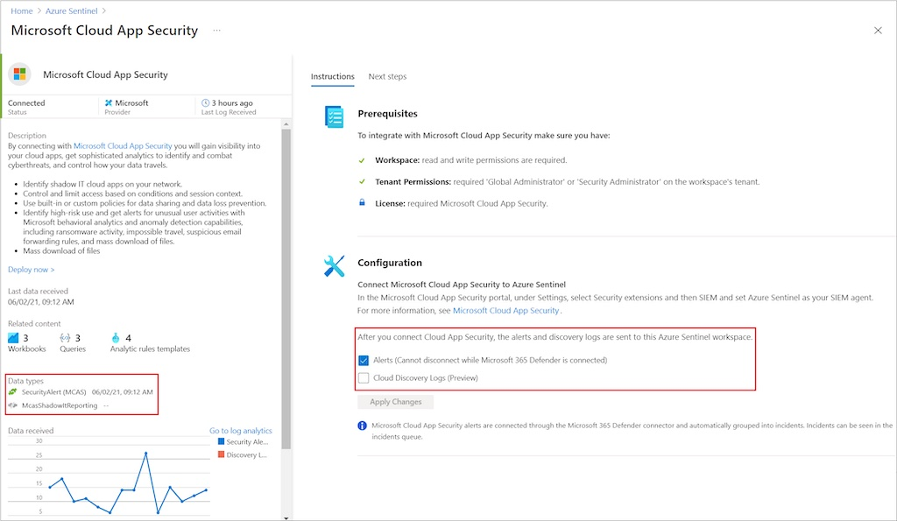
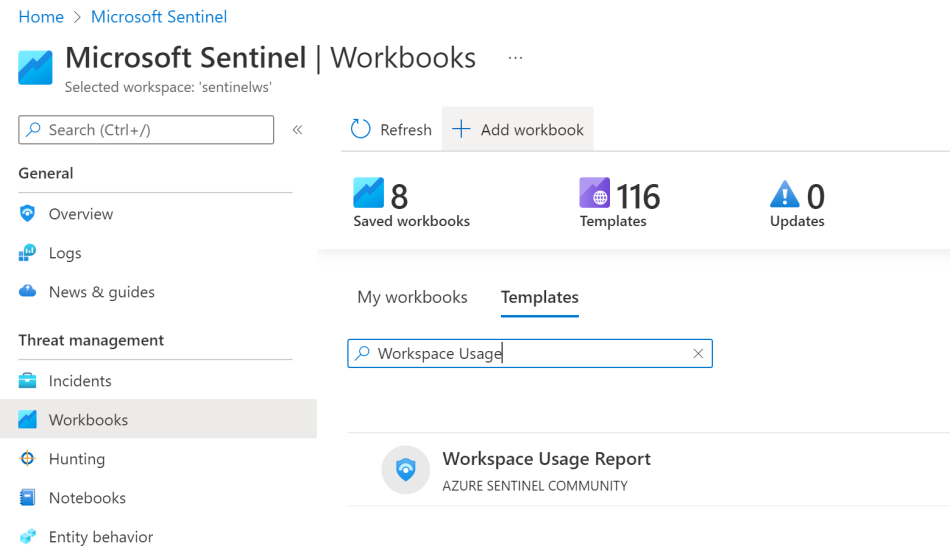

Nelle prime fasi di adozione può risultare un po’ difficile capire quali siano i reali costi dei dati raccolti dai data connector: quali sono le sorgenti dati gratuite di Microsoft Sentinel e quali quelle a pagamento? Pianificare la spesa di Sentinel in maniera attenta è molto importante ai fini di evitare sorprese in fase di fatturazione. Ecco un elenco (con relative fonti di documentazione) per capirlo.

## Sorgenti dati gratuite di Microsoft Sentinel
In generale, sono sempre gratuite le seguenti sorgenti dati:
- Azure activity logs;
- Office 365 Audit Logs, incluse le attività di SharePoint , Exchange admin e Teams;
- i Security alerts, inclusi quelli da Microsoft Defender for Cloud, Microsoft 365 Defender, Microsoft Defender for Office 365, Microsoft Defender for Identity e Microsoft Defender for Endpoint;
- alcuni dati di Microsoft Defender for Cloud Apps.

## Data connector che contengono sia sorgenti a pagamento che gratuite
In alcuni casi, ci sono dei data connector che includono sia sorgenti dati gratuite che a pagamento. Quando succede questo, nella pagina del connettore è segnalato ed è possibile gestire separatamente l’attivazione delle sorgenti gratuite da quelle a pagamento. Ecco un esempio.

## Tabella dei data connector e delle loro sorgenti dati
Come dicevo poco fa, alcuni data connector contengono sia sorgenti a pagamento che gratuite. Ecco una tabella aggiornata al 16 febbraio 2022.

***Nota***: per avere una tabella sempre aggiornata, ti consiglio di fare riferimento alla documentazione Microsoft.

- [Plan and manage costs for Microsoft Sentinel | Microsoft Docs](https://docs.microsoft.com/en-us/azure/sentinel/billing#free-data-sources)


  


| Microsoft Sentinel Data Connector     | Sorgente dati                           | Gratuito o a pagamento |
|:--------------------------------------|:----------------------------------------|:-----------------------|
| **Azure Activity Logs**               | AzureActivity                           | Gratuita               |
| **Azure AD Identity Protection**      | SecurityAlert (IPC)                     | Gratuita               |
| **Office 365**                        | OfficeActivity (SharePoint)             | Gratuita               |
|                                       | OfficeActivity (Exchange)               | Gratuita               |
|                                       | OfficeActivity (Teams)                  | Gratuita               |
| **Microsoft Defender for Cloud**      | SecurityAlert (Defender for Cloud)      | Gratuita               |
| **Microsoft Defender for IoT**        | SecurityAlert (Defender for Cloud)      | Gratuita               |
| **Microsoft 365 Defender**            | SecurityIncident                        | Gratuita               |
|                                       | SecurityAlert                           | Gratuita               |
|                                       | DeviceEvents                            | A pagamento            |
|                                       | DeviceFileEvents                        | A pagamento            |
|                                       | DeviceImageLoadEvents                   | A pagamento            |
|                                       | DeviceInfo                              | A pagamento            |
|                                       | DeviceLogonEvents                       | A pagamento            |
|                                       | DeviceNetworkEvents                     | A pagamento            |
|                                       | DeviceNetworkInfo                       | A pagamento            |
|                                       | DeviceProcessEvents                     | A pagamento            |
|                                       | DeviceRegistryEvents                    | A pagamento            |
|                                       | DeviceFileCertificateInfo               | A pagamento            |
| **Microsoft Defender for Endpoint**   | SecurityAlert (MDATP)                   | Gratuita               |
| **Microsoft Defender for Identity**   | SecurityAlert (AATP)                    | Gratuita               |
| **Microsoft Defender for Cloud Apps** | SecurityAlert (Defender for Cloud Apps) | Gratuita               |
|                                       | MCASShadowITReporting                   | A pagamento            |

## Come tenere sotto controllo la spesa di Microsoft Sentinel
Esiste un utilissimo workbook creato dalla community di Sentinel e che è disponibile direttamente da portale Microsfot Sentinel nel catalogo dei Data Connector: il **Workspace Usage Report**.

Molto interessante la parte in cui, basandosi sul consumo degli ultimi 30, 60 o 90 giorni, viene fatta una proiezione dell’ingestion di dati futura mostrando il trend della quantità di dati e, quindi, dei costi.

**Questo workbook non può mancare nella tua collezione!**

E tu, come tieni sotto controllo la spesa di Microsoft Sentinel? Ti aspetto sui miei social per parlarne insieme!

Il tuo IT Specialist,  
Riccardo