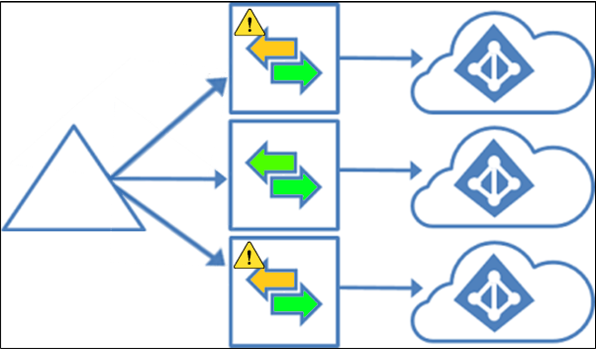

Nell’ultimo periodo Mirosoft sta rilasciando tante novità che prendono spunto dal caro vecchio User Voice. Oggi è uno di quei giorni: l’Azure AD Connect multi-tenant sync finalmente è realtà!

Vediamo però nel dettaglio limitazioni e consigli d’uso:
- AAD Connect potrà sincronizzare gli stessi utenti, gruppi, contatti verso più tenant;
- sarà necessario installare un server AD Connect per ogni tenant Azure AD verso cui si vorrà sincronizzare;
- è supportato avere diversi sync scope e avere differenti regole di sincronizzazione per tenant diversi;
- su uno e un solo tenant sarà possibile configurare il writeback di gruppi e dispositivi;
- su uno e un solo tenant sarà possibile implementare una configurazione ibrida di Exchange;
- su uno e un solo tenant sarà possibile configurare il Seamless Single Sign-on (SSSO) e Hybrid Azure AD Join;
- è supportato configurare il Password Hash Sync su più tenant per lo stesso oggetto utente;
- se PSH è abilitato, si potrà abilitare anche il Password writeback, su più tenant. Se la password dell’utente viene modificata in un tenant, viene allineata dal cloud verso Active Directory on-prem e poi sinccronizzata anche verso gli altri tenant;
- non si può aggiungere e/o verificare lo stesso dominio su più tenant.

Queste le best practice e limitazioni salienti che ho estrapolato dall’articolo.

Se vuoi approfondire l’argomento, ecco tutto quello che serve, direttamente da Docs di mamma Microsoft:

- [Azure AD Connect: Multiple Azure AD tenants | Microsoft Docs](https://docs.microsoft.com/en-us/azure/active-directory/hybrid/plan-connect-topologies#multiple-azure-ad-tenants)
- [Azure AD Connect: Supported topologies | Microsoft Docs](https://docs.microsoft.com/en-us/azure/active-directory/hybrid/plan-connect-topologies)

Questa novità potrebbe potenzialmente stravolgere alcune architetture di sincronizzazione e di autenticazione ibrida consolidate negli anni. Tu che ne pensi? In che modo potrebbe esserti utile l’Azure AD Connect multi-tenant sync? Parliamone insieme nei commenti!

Il tuo IT Specialist,  
Riccardo
