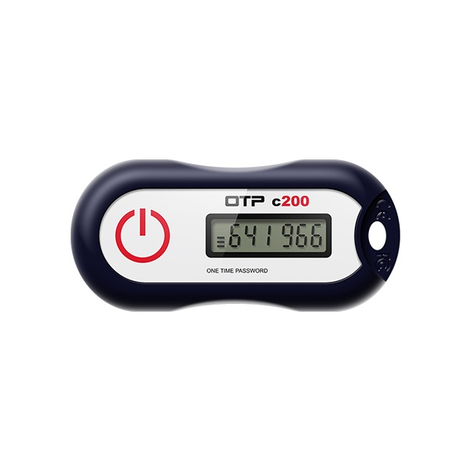
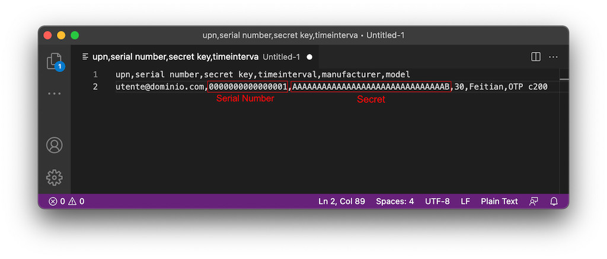
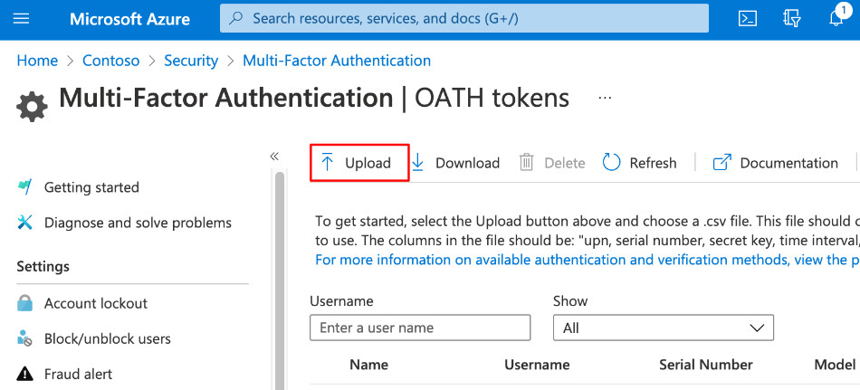
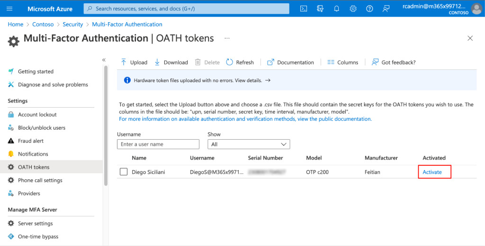
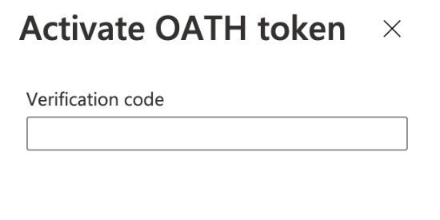
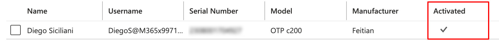
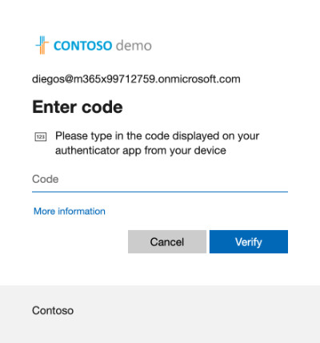
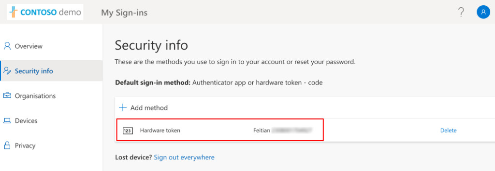

Diciamoci la verità, subito: quando si parla di Multi Factor Authentication (MFA) in Azure AD, l’obiezione che ricorre nel 99,9% dei casi è sempre la stessa: “Non tutti gli utenti hanno un dispositivo aziendale e chi non ce l’ha non è disposto ad installare un’app sul proprio smartphone personale”. Obiezione sacrosanta, fine dei giochi e, quasi tutti, implementano solo un pilota per un gruppo ristretto di utenti con smartphone aziendale, lasciando scoperta una buona fetta di utenti, quelli senza dispositivo.

Certo, esistono altri metodi di verifica ma, purtroppo, hanno dei limiti che si scontrano sempre con le stesse problematiche:
- SMS e/o chiamata su mobile: l’utente senza dispositivo aziendale, che già non è disposto ad installare Microsoft Authenticator App, non sarà propenso nemmeno a fornire il numero di telefono personale;
- chiamata su numero in ufficio: in questo caso la limitazione è puramente logistica, dal momento che si rimane legati (letteralmente 😉) a doppio filo al telefono sulla propria scrivania, a meno di fare una deviazione. Decisamente poco pratico.

Da qualche tempo è disponibile su Azure AD un metodo di verifica del fattore di autenticazione che, a mio modo di vedere, risolve in maniera ragionevole le problematiche sopra descritte: il token OATH TOTP.

## Cos’è un token OATH TOTP?
OATH è un’architettura di riferimento per metodi di autenticazione forte e definisce gli standard aperti per la generazione password monouso. Questi codici possono essere generati in un software oppure in un token fisico (hardware) e cambiano ogni 30 o 60 secondi (Time-based One Time Password = TOTP).

**Seppur in preview, Azure AD supporta i token hardware OATH TOTP come metodo di autenticazione in aggiunta alla password e, quindi, come metodo di verifica della MFA.**

Nota: ho specificato esplicitamente TOTP perché Azure AD supporta solo i token OATH TOTP, e non gli HOTP (Event-based One Time Password). Questo è molto importante da ricordare in fase di acquisto dei token!

Un token fisico OATH TOTP, quindi, è a tutti gli effetti un dispositivo aziendale, molto meno costoso di uno smartphone (per i modelli base si parla di circa 20 €) e che può essere assegnato ad un utente.

## Requisiti, licenze, caveat
Prima di tutto: la funzionalità è ancora in preview, al momento in cui questo articolo è stato pubblicato. Quindi, se stai pensando ad un’implementazione massiva, devi tenere conto di questo fattore, con tutte le eventuali implicazioni del caso.

Detto questo, agli utenti a cui verrà dato un token hardware servirà:
- una licenza M365 che comprenda **Azure AD Premium P1** oppure **P2**;
- un token OATH TOTP hardware.

A te che implementi la soluzione, invece servirà:
- avere il numero seriale di ogni token (per il Feitian C200 è scritto sul retro);
- per ogni token, se non programmabile come nel mio caso, serve avere la stringa di testo contenente il segreto pre-condiviso (Pre Shared Secret): vedrai tra poco a cosa serve e come usarlo;
- decidere a chi assegnare ogni token (1:1).

## Il token usato per questo articolo: Feitian c200 OATH TOTP
Prima di iniziare con la configurazione vera e propria, una piccola introduzione sul token che ho utilizzato per scrivere questo articolo: è un **Feitian c200 OATH TOTP**, token hardware a singolo pulsante con refresh dell’OTP a 30 secondi.

**È pienamente compatibile con Azure AD e funziona davvero bene**. Feitian sta diventando rapidamente un riferimento nell’ambito delle security key ed è [menzionata esplicitamente in documentazione Microsoft come produttore certificato](https://docs.microsoft.com/en-us/azure/active-directory/authentication/concept-authentication-passwordless#fido2-security-key-providers). Anche questo aspetto, in fase di acquisto di una security key FIDO2 o, in questo caso, di un token OATH hardware, è da tenere in considerazione!

Se vuoi approfondire l’offerta di Feitian sui token OTP, ecco un link utilissimo:
- [Single Button HOTP/TOTP token | FEITIAN (ftsafe.com)](https://www.ftsafe.com/Products/OTP/Single_Button_OTP?utm_source=Riccardo+Corna&utm_medium=Article&utm_campaign=OTP+Webpage)

Qui di seguito, invece, il link diretto al token usato in questi test e all’offerta completa dei token OTP di Feitian:

- [OTP c200 OATH Time-Based (TOTP) Token – FEITIAN (ftsafe.com)](https://www.ftsafe.com/store/product/otp-c200-oath-time-based-totp-token/)
- [OTP Authentication – FEITIAN (ftsafe.com)](https://www.ftsafe.com/store/product-category/otp-authentication/#productCategory)
Feitian mi ha anche rilasciato un codice sconto esclusivo del 20%: se sei interessato ad acquistare un token sullo store di Feitian, perché non approfittarne? 😉


  

    Riccardo-20
  



## Esperienza staff IT: configurare MFA OATH Token su Azure AD
Perfetto, ora è tutto pronto per iniziare! Questi sono i passaggi che l’amministratore IT dovrà fare per configurare i token hadrware e associarli agli utenti.

### Step 1: enforcement MFA
Prima di tutto, l’utente o gli utenti a cui vorrai assegnare un token, dovranno essere abilitati alla MFA. Puoi farlo in due modi:
1. abilitandoli per-user alla MFA dal pannello legacy (sconsigliato);
2. intercettandoli attraverso una policy di Conditional Access (di gran lunga meglio), in modo che la MFA sia “Required”.

### Step 2: creare un file CSV contenente utenti e dati dei token
Ora, crea un file testuale in formato CSV, all’interno del quale si inseriranno tutti i dettagli che servono per associare uno specifico token ad uno specifico utente.

Il file dovrà essere formato in un certo modo e dovrà contenere colonne e dati specifici. Ecco quali sono:
- **upn**: è lo username dell’utente a cui verrà assegnato il token hardware;
- **serial number**: è il numero seriale del token, nel caso del Feitian C200 è scritto sul retro;
- **secret key**: è il segreto pre-condiviso che **ti viene fornito dal produttore** una volta acquistato il token;
- **time interval**: l’intervallo di aggiornamento/validità del codice OTP, nel mio caso è 30 secondi;
- **manufacturer**: il nome del produttore, nel mio caso è Feitian;
- **model**: il modello del token, nel mio caso è OTP c200 ma puoi anche compilarlo con un valore tipo “HardwareToken” o cose simili.

Ecco che aspetto dovrebbe avere il tuo file CSV.

***Nota***: in questo esempio il file contiene una sola riga perché avevo a disposizione un solo token. Nella realtà, se devi caricare (ad esempio) 30 token, chiaramente potrai farlo con un solo file da 30 righe, ognuna delle quali conterrà i valori pertinenti.

### Step 3: caricare il file CSV in Azure AD
Ora vai sul portale di Azure, alla sezione:
- **Azure AD** –> **Security** –> **MFA** –> **OATH Tokens**

e seleziona il tasto Upload, caricando il file che hai confezionato allo step precedente.

Potrai verificare che il caricamento del file è andato a buon fine dal messaggio di conferma del portale Azure e dal fatto che, una volta terminato l’upload, vedrai l’elenco di utenti e token a portale.

### Step 4: attiva il token
A questo punto, attiva il token cliccando su Activate.

Per verificare il token, dovrai, nell’ordine:
1. premere il pulsantone del tuo token fisico, in modo che compaia il codice OTP sul suo display
2. inserire il codice a portale Azure

Se la verifica va a buon fine, il token è pronto e attivo!

Perfetto! Ora puoi consegnare il token all’utente. 😉


  
<iframe src="https://giphy.com/embed/d5pGYhWb3T1Hyyl8OB" width="100%" height="100%" style="position:absolute" frameBorder="0" class="giphy-embed" allowFullScreen></iframe>

<a href="https://giphy.com/gifs/d5pGYhWb3T1Hyyl8OB">via GIPHY</a>



## Esperienza utente
Lato utente, quale sarà l’esperienza? Proviamolo insieme andando su https://portal.office.com.

L’utente inserirà le sue credenziali (UPN e password) come sempre ma, anziché essere subito rediretto al portale Microsoft 365… voilà!

È fatta! L’utente ora ha un metodo sicuro per accedere ai dati e alle applicazioni aziendali, senza aver dovuto installare nessuna app sullo smartphone personale e senza aver dovuto registrare il proprio numero di telefono personale su Azure AD!

Piccola curiosità: accedendo al pannello di controllo del proprio account M365, alla sezione “Security Info” (https://mysignins.microsoft.com/security-info), il token è già censito come metodo di verifica, senza che l’utente abbia dovuto fare nulla. Comodo, vero?

## Considerazioni sulla MFA con OATH token
Un ultimo chiarimento prima di chiudere: agli occhi di Azure AD e delle autenticazioni, questo è un semplice metodo di verifica, non un metodo di autenticazione primario. Cosa significa? Che, a differenza dell’Authenticator o delle chiavette FIDO2, che sono dei metodi di autenticazione primari che possono essere usati in un contesto passwordless, la MFA con OATH token è un metodo di autenticazione secondario, ovvero può essere usato solo ed esclusivamente in aggiunta alla password come metodo di verifica, non sostituirla.

Se vuoi approfondire queste e altre questioni, come sempre ecco un godzilione di documentazione utile:
- [Single Button HOTP/TOTP token | FEITIAN (ftsafe.com)](https://www.ftsafe.com/Products/OTP/Single_Button_OTP?utm_source=Riccardo+Corna&utm_medium=Article&utm_campaign=OTP+Webpage)
- [OATH tokens authentication method – Azure Active Directory | Microsoft Docs](https://docs.microsoft.com/en-us/azure/active-directory/authentication/concept-authentication-oath-tokens)
- [Authentication methods and features – Azure Active Directory | Microsoft Docs](https://docs.microsoft.com/en-us/azure/active-directory/authentication/concept-authentication-methods)
- [Azure Active Directory passwordless sign-in | Microsoft Docs](https://docs.microsoft.com/en-us/azure/active-directory/authentication/concept-authentication-passwordless)

## Conclusioni
Bene, anche questa volta mi hai seguito fino alla fine di questo articolo tosto e lungo: grazie!

E tu, che ne pensi di questo metodo? Pensi che si possa calare facilmente nella tua realtà per gli utenti senza uno smartphone aziendale? Parliamone insieme sui miei social, ti aspetto!

Il tuo IT Specialist,  
Riccardo

