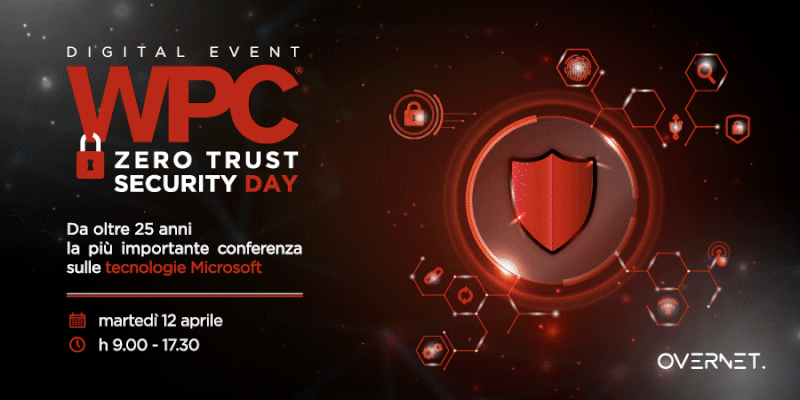

❗️ Ebbene sì, ci sarò anch’io a WPC Days Overnet 2022 e, nello speech insieme a [Marco Moioli](https://www.linkedin.com/in/ACoAAAEX8AsBm7Teu0DcdcfrMDfQQ52deQnIgrg), daremo il nostro contributo nel raccontarvi cosa significa Zero Trust Security!

💯 Sono stra-felice e super-emozionato di partecipare a questo evento come speaker: non vedo l’ora!

👉🏻 Per iscriverti – [https://bit.ly/WPCDays2022ZeroTrustSecurity](https://bit.ly/WPCDays2022ZeroTrustSecurity)

🔹 Per dettagli e novità e per scoprire tutte le sessioni e gli speaker:  
👉🏻 [Speaker](https://www.wpc-days.it/#speakers)  
👉🏻 [Agenda](https://www.wpc-days.it/#agenda)

Ti aspetto!

Il tuo IT Specialist, Riccardo