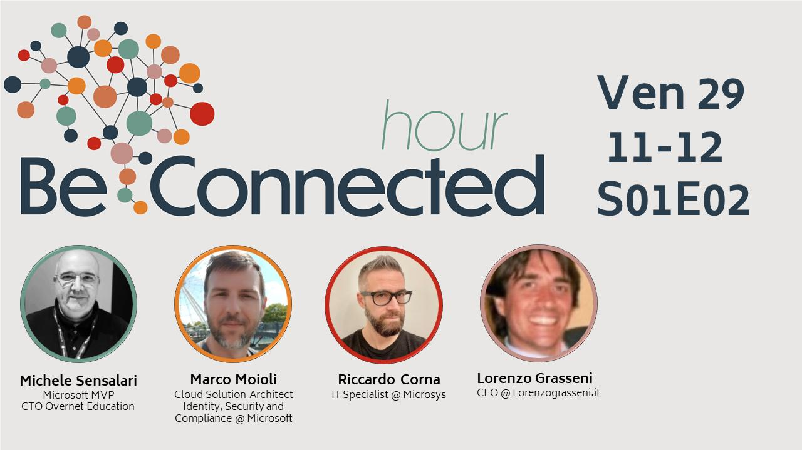

In che modo è possibile avere una panoramica completa delle novità in ambito Microsoft Security, in un’ora soltanto?
Semplice, basta partecipare alla Be Connected Hour di domani venerdì 29 Aprile alle 11.00!
Insieme a [Michele Sensalari](https://www.linkedin.com/in/michele-sensalari-4988b7/), [Lorenzo Grasseni](https://www.linkedin.com/in/lorenzograsseni/) e [Marco Moioli](https://www.linkedin.com/in/marcomoioli/) abbiamo raccolto per te le novità più interessanti ed importanti!

Puoi iscriverti qui:
- [Be Connected Hour 29 Aprile 2022](https://www.linkedin.com/video/event/urn:li:ugcPost:6922573722423816192/)

Ecco l’agenda completa:
- Nuove topologie e novità di Azure AD Connect
- Evoluzione delle metodologie di PasswordLess authentication
- Rilevare e rispondere ad attività malevole sull’identità con Microsoft Defender for Identity e Azure AD Identity Protection
- Gestione della delega amministrativa in Azure AD
- Microsoft Defender for Endpoint per tutti i piani Microsoft 365: novità e funzionalità
- Le novità nella gestione e protezione degli endpoint con Microsoft Endpoint Manager
- Windows 365 funzionalità per la sicurezza del tuo Cloud PC
- Proteggere i tuoi strumenti di collaborazione con Microsoft Defender for Office 365 e Microsoft Information

E questo è solo un assaggio di quanto sarà ricco il prossimo BeConnected day del prossimo 15 Giugno! 😉

Ti aspetto!

Il tuo IT Specialist, Riccardo