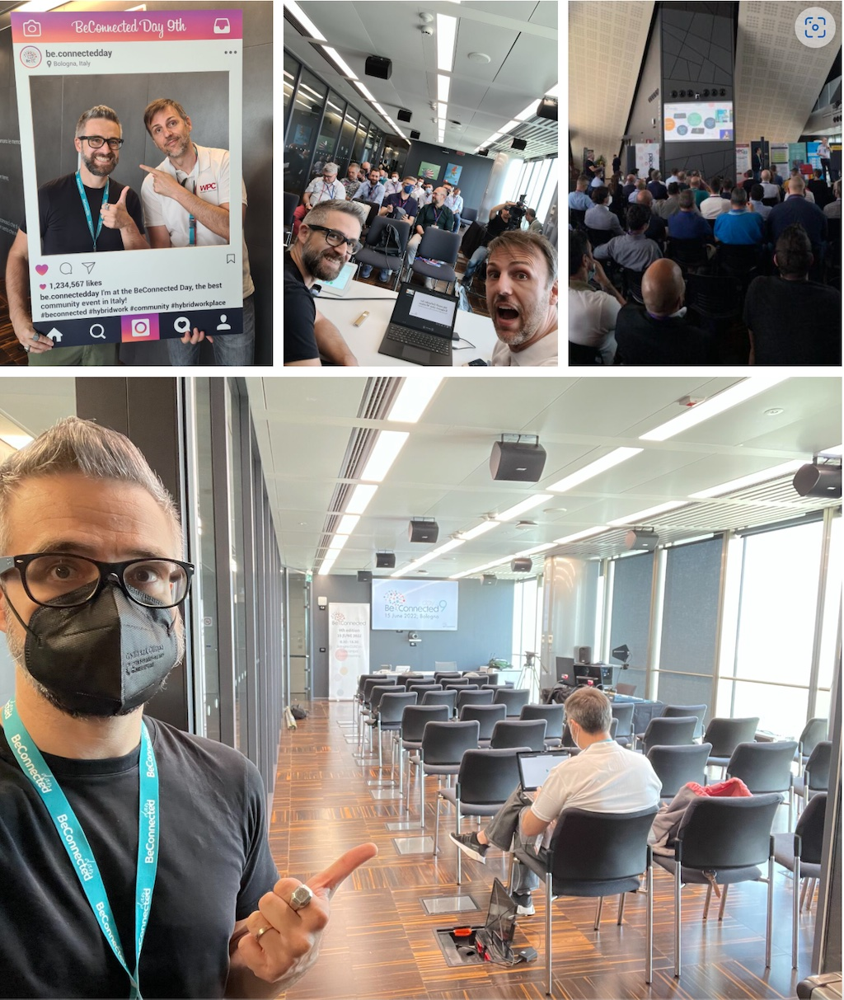

Per poco (maledetto CoViD) non rischiavo di perdermi l’emozione di questa giornata che aspettavo da tanto... e invece (per fortuna) me lo sono proprio goduto questo BeConnected day dal vivo, insieme a tantissime persone e con altrettante sessioni interessantissime.

Insieme all’immancabile Marco Moioli, abbiamo tenuto una sessione su Microsoft Defender for Endpoint, parlando delle sue funzionalità sugli altri sistemi operativi oltre Windows: macOS, Linux, iOS, Android. Non appena verrà pubblicato il video sui canali social di Be Connected Day, ti aggiornerò qui sul blog e anche su Linkedin.

Detto questo, impressioni sparse sulla giornata.

Per quanto mi riguarda era il debutto assoluto come speaker in una sessione dal vivo, dove per “dal vivo” intendo parlare avendo davanti decine di persone in un’aula/auditorium e non uno schermo. È andata molto bene e avere un pubblico in carne ed ossa mi ha dato davvero una carica enorme.

Ho incontrato nuovamente (e con piacere) facce note e conosciuto facce nuove: non vedo l’ora che ci sia un altro evento a breve perché è la sensazione migliore di queste giornate.

La Torre Unipol è davvero un bello spazio, l’evento è stato organizzato molto bene e tutto girava come un orologio svizzero. Sono stato molto bene!

Un enorme grazie a tutti gli organizzatori del Be Connected Day, a Michele Sensalari che mi ha invitato e mi ha aspettato fino all’ultimo secondo utile, a Marco Moioli immancabile partner in crime e, infine, a tutti gli altri speaker della track SEC: Carlo Mauceli, Lorenzo Grasseni, Matteo Creati, Giuseppe Di Pasquale, Michela Lecce.

E tu? Se eri a Bologna e hai seguito la sessione, fammi sapere se ti è piaciuta e cosa ne pensi delle funzionalità di MDE sulle piattaforme non-Windows: ti aspetto sui miei profili social per parlarne insieme. A presto!

Il tuo IT Specialist, Riccardo