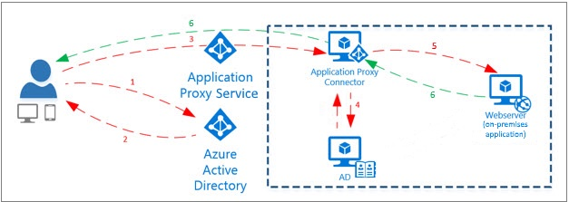

Azure AD Application Proxy è un prodotto che ti consente un accesso sicuro ad applicazioni web on-premises, attraverso autenticazione su Azure AD e un connettore sicuro. Nell’adoption kit di oggi, una panoramica e una guida "get-started" proprio su Azure AD Application Proxy!

Scarica dal seguente link l’Adoption Kit di Azure AD Application Proxy.

- ➡️ [Adoption Kit di Azure AD Application Proxy](./resources/AppProxy.pdf)

Hai mai consultato uno di questi adoption kit? Se sì, come ti sei trovato? Parliamone insieme sui miei profili social! A presto.

Il tuo IT Specialist, Riccardo

