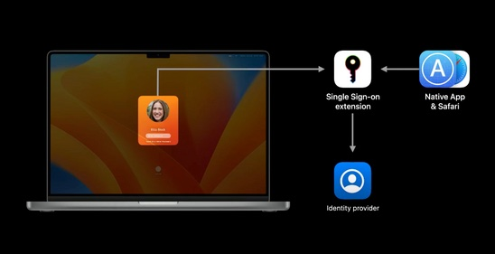

Anche se non ci sono ancora moltissimi dettagli, la notizia che, con il prossimo macOS 13 (Ventura), sarà possibile fare Single Sign-On con credenziali Azure AD anche a livello di login di sistema operativo/piattaforma macOS, mi ha esaltato e sconfortato allo stesso tempo, per due motivi:

- ESALTATO: è una funzionalità che in TANTISSIMI stavano aspettando e volevano fortemente
- SCONFORTATO: il mio video di poco tempo fa sul [Single Sign-On di macOS](/azure-ad-single-sign-on-app-extension-macos-prova-sul-campo) su Azure AD invecchierà malissimo e in pochissimo tempo e mi toccherà rifarlo 😭🤣

Scherzi a parte, finalmente si chiuderà un cerchio che mette definitivamente una pietra sopra al binding dei Mac in Active Directory e permetterà finalmente di utilizzare le credenziali aziendali Azure AD (o forse dovrei iniziare a dire “Microsoft Entra”…) senza implementare soluzioni di terze parti.

Ecco l’annuncio e approfondimenti vari sull’argomento macOS Single Sign-on in Azure AD:

- [Microsoft simplifies Endpoint Manager enrollment for Apple updates – Microsoft Tech Community](https://techcommunity.microsoft.com/t5/microsoft-endpoint-manager-blog/microsoft-simplifies-endpoint-manager-enrollment-for-apple/ba-p/3570319)
- [Microsoft Enterprise SSO plug-in for Apple devices – Microsoft Entra | Microsoft Docs](https://docs.microsoft.com/en-us/azure/active-directory/develop/apple-sso-plugin)
- [Merill Fernando su Twitter: “Platform single sign on is coming to macOS! What does this mean? Users can now sign into a mac with their AD/Azure AD credentials just like Windows users. Users will then get single sign on to ALL THE APPS with a PRT token just like on Windows. See https://t.co/8NUzdaSQoV https://t.co/HOItgVPdvR” / Twitter](https://twitter.com/merill/status/1549710936709398528?s=20&t=9wgFt0mxkRIhnqfPVMTq1A)
- [Azure AD Single Sign-On macOS App Extension – YouTube](https://www.youtube.com/watch?v=jKLXHIbLu0s) (questo è il famoso video che sta invecchiando malissimo ma ci sono comunque elementi utili per comprendere e configurare il plugin di SSO)

L’integrazione dei Mac in azienda sta diventando un tema sempre più interessante e d’attualità: tu che ne pensi? Parliamone insieme sui miei profili social!

Il tuo IT Specialist,  
Riccardo