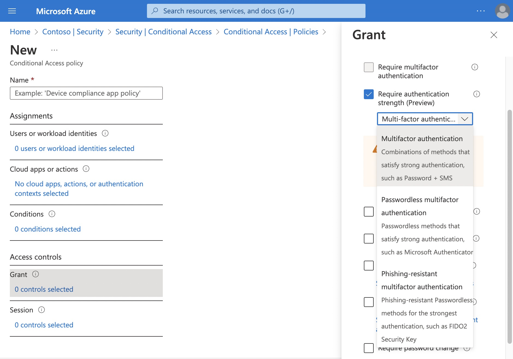
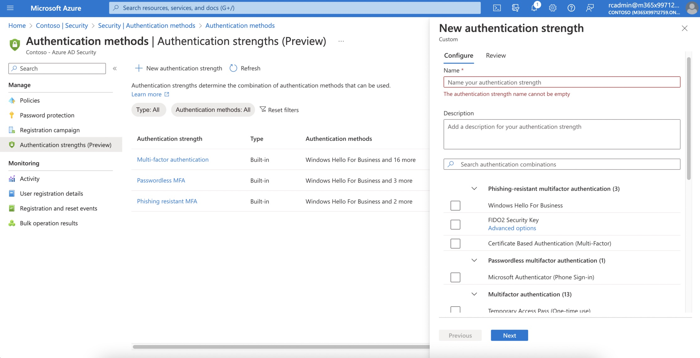

Novità fresca fresca in ambito conditional access di Azure AD, in particolare per quanto riguarda le opzioni di “Grant”. Fino ad oggi, per forzare un’autenticazione forte, era necessario impostare “Require Multi Factor Authentication” all’interno delle Grant ma questo non consentiva di fare alcuna distinzione tra le varie tipologie di autenticazione forte disponibili all’interno di Azure AD e implementate nel tenant.

Da oggi, in preview, si può specificare direttamente dentro una policy di accesso condizionale quale tipologia di autenticazione deve essere soddisfatta per avere accesso (Grant). Eco una schermata dell’anteprima.

Come vedi, ci sono alcune combinazioni già definite, divise per livello di robustezza della soluzione di MFA (authentication strenght).

Tra l’altro, è anche possibile definire delle combinazioni personali. Basta andare all’interno del menu:
- **Azure Active Directory** –> **Security** –> **Authentication methods** –> **Authentication strenghts**

In che modo può essere utile?

- Ad esempio per differenziare policy di accesso condizionale per amministratori e utenti standard, impostando metodi differenti e più “forti” di multi factor auth.
- Per segmentare e distribuire meglio le tipologie di autenticazioni forti in base a quali metodi sono disponibili in relazione al tipo di destinatari: qualcuno potrebbe avere a disposizione l’Authenticator perché ha un telefono aziendale mentre altri gruppi di lavoro usano un token OTP o altro ancora.
- Definire combinazioni personalizzate di autenticazione forte permette di ritagliare le strategie di autenticazione in maniera più aderente al proprio ambiente.

Come al solito, ecco un po’ di documentazione umidiccia di inizio autunno sui metodi di autenticazione forte:
- [Authentication methods and features – Azure Active Directory – Microsoft Entra | Microsoft Learn](https://learn.microsoft.com/en-us/azure/active-directory/authentication/concept-authentication-methods)

E tu che ne pensi? Nel tuo ambiente o negli ambienti che gestisci hai già definito uno solo o più metodi di autenticazione forte? Parliamone insieme nei commenti, ti aspetto!

Il tuo IT Specialist,  
Riccardo