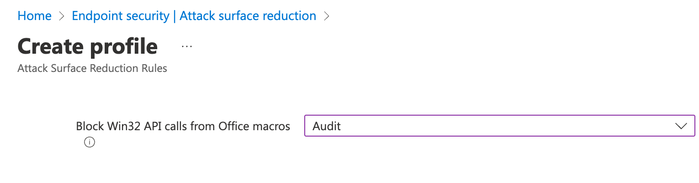

L'aggiornamento di Defender del 13 gennaio 2023 (KB2267602 - versione 1.381.2140.0) ha causato alcuni problemi su shortcut e link salvati su Desktop e menu Start, cancellandoli o rendendoli non più funzionanti. Inoltre, con una particolare regola di ASR (**Block Win32 API calls from Office macro**) settata su **Block**, alcune applicazioni venivano bloccate.

A riguardo della regola di ASR, un primissimo workaround prevedeva di impostare la regola **Block Win32 API calls from Office macro** a livello **Audit**.

Al momento in cui leggerai questo articolo, però, non dovrebbe più servire perchè Microsoft già da venerdì ha avviato un rollback e aperto una comunicazione ad-hoc sul portale di Microsoft 365: **MO497128**.


  <blockquote class="twitter-tweet">
We&#39;re investigating an issue where users are unable to access application shortcuts on the Start menu and Taskbar in Windows. For more details and updates, please follow the SI MO497128 in your admin center.
&mdash; Microsoft 365 Status (@MSFT365Status) <a href="https://twitter.com/MSFT365Status/status/1613871552256155649?ref_src=twsrc%5Etfw">January 13, 2023</a></blockquote> 


A riguardo della problematica dei link/shortcut cancellati, è stata pubblicata una remediation.


  <blockquote class="twitter-tweet">
We&#39;ve confirmed steps to recreate start menu links for a significant sub-set of the affected applications that were deleted. Please visit <a href="https://t.co/FYLP1Jvg7Y">https://t.co/FYLP1Jvg7Y</a> for further guidance. Further updates can be found in the admin center under MO497128.
&mdash; Microsoft 365 Status (@MSFT365Status) <a href="https://twitter.com/MSFT365Status/status/1614187668723613702?ref_src=twsrc%5Etfw">January 14, 2023</a></blockquote> 


Se sei stato impattato dal problema, ho raccolto per te alcune risorse per ripristinare tutti i link e gli shortcut cancellati:
- [Recovering from Attack Surface Reduction rule shortcut deletions](https://techcommunity.microsoft.com/t5/microsoft-defender-for-endpoint/recovering-from-attack-surface-reduction-rule-shortcut-deletions/ba-p/3716011) (Fornita direttamente da Microsoft)
- [Identifying and restoring shortcuts to start menu from Microsoft incident MO497128](https://cloudscript.tech/2023/01/13/breakfix-for-microsoft-si-mo497128-deleting-shortcuts/) (Un'altra procedura di recovery utile non ufficiale)
- [How to implement a gradual (ring) rollout-process for Microsoft Defender updates](https://mortenknudsen.net/?p=737) (Grazie a [Gabriele Ambrosi](https://www.linkedin.com/in/gabriele-ambrosi/) per la segnalazione)

In bocca al lupo!

Il tuo IT Specialist,
Riccardo