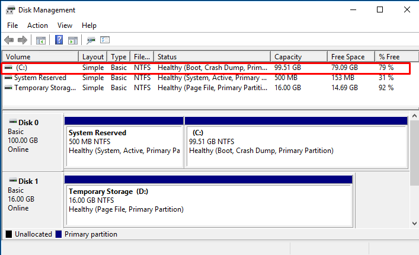

Shrinking the disk size of a VM in Azure to save on storage costs? With a little bit of tinkering and some PowerShell magic, it can be done.

Today, I'm stepping a bit outside the usual topics I cover. 😉

A few days ago, I was looking at the consumption of my lab subscription and noticed that the disk costs were eating up a good chunk of my (limited) monthly budget.

That didn't sit well with me, considering that the few VMs I use are almost always powered off, and the actual disk usage was minuscule compared to the disk sizes (Standard SSD, 128GB E10).

So, I asked myself:

> *"Why pay for an E10 when an E6 with 64GB would suffice?"*

And thus, I scoured the web in search of something useful, which I eventually found. Here's a fantastic procedure for shrinking the disk size of an Azure VM:

➡️ [Shrink an Azure VMs OS Managed Disk using PowerShell](https://jrudlin.github.io/2019-08-27-shrink-azure-vm-osdisk/)

***Please note***: ***This procedure should be carefully evaluated in critical production environments that have specific configurations on managed disks. The script is provided by the author "as-is," without any warranties of any kind.***

Personal experience: I tried it on two lab machines, one of which is a domain controller, and everything went smoothly. Regarding the execution of the script, it's best to copy and paste each command step-by-step because (as the author also mentions on their blog), there is no error handling logic. Therefore, in case of issues, it would be difficult to determine where things went wrong.

**It is strongly advised to carefully evaluate everything before performing the procedure on production workloads.**

Well, now you're ready to save some bucks. 😃 Good luck!

Riccardo