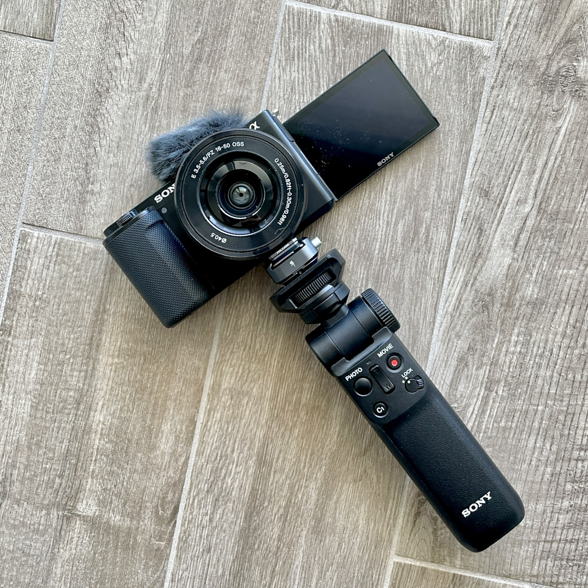

I have plans to introduce a different type of video, in addition to the usual tutorials, in the future. Yesterday, I tested the "vlog setup" for the first time.

First impressions: excellent image quality (I had no doubts with this Sony camera), the grip is great and doubles as a remote control, and the Falcam quick release is very convenient.

Things to assess: audio quality, as I'm using the built-in microphone, and stabilization.
The biggest unknown is the stabilization aspect: the camera has some minimal stabilization, but it's not designed for vlogging while walking, and the lens doesn't have stabilization either.
I believe I will use the stabilization feature in Sony's Catalyst Browse once I import the video to my Mac.

Let's see how it turns out... 😃

Riccardo