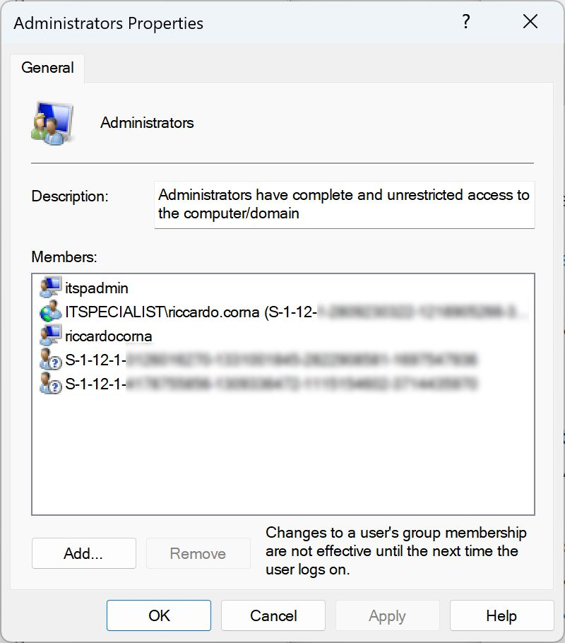

Venerdì risorsa! Se state giochicchiando con le policy di Local Groups Membership in Intune e (come me) avete imprecato almeno un po' nel convertire ObjectId di gruppi/ruoli in SID e viceversa, ecco un sito che lo fa online in maniera immediata e comoda.

🔹 [ObjectId ➡️ SID](https://erikengberg.com/azure-ad-object-id-to-sid/)  
🔹 [SID ➡️ ObjectId](https://erikengberg.com/azure-ad-sid-to-object-id/)

Mi piacerebbe taggare qui l'autore di questa utility meravigliosa (Erik Engberg) ma, da quanto ho visto, non è su Linkedin. Se mi fossi sbagliato e qualcuno sapesse qual è il suo profilo esatto, me lo segnali in modo che io possa dargli i giusti ringraziamenti.

Domandone finale: mentre per i gruppi trovare l'ObjectId è semplicissimo, voi dove andate a vedere questo valore per i ruoli di Azure AD? Parliamone insieme sui miei profili social!

Riccardo
