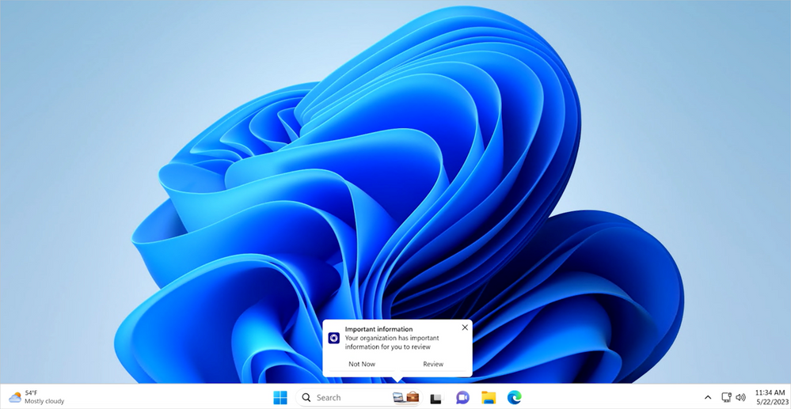

Arrivano gli Organizational Messages in Intune (in GA dal 31/5)! Organizzare una campagna di comunicazione verso gli utenti in caso di update urgenti o rilascio di nuove configurazioni che impattano sull’esperienza utente ora sarà più facile.

Ecco le informazioni salienti di licensing e requisiti.

📌 **Licenze**
- Microsoft 365 E3
- Microsoft 365 E5
- Windows 10/11 Enterprise E3 with Microsoft Intune Plan 1
- Windows 10/11 Enterprise E5 with Microsoft Intune Plan 1

📌 **Sistemi operativi**
- Windows 11 (22H2) o più recenti

📌 **Ci sono due nuovi ruoli di Azure AD**
- Intune Organizational Messages Manager
- Azure AD Organizational Messages Writer

📌 **Requisiti per le immagini**
- 48 x 48 pixel (messaggi nell’area delle Notifiche)
- 64 x 64 pixel (messaggi nell’area Taskbar)
- 50 x 50 pixel o 50 x 100 pixel (messaggi di tipo “Get started”)
- formato PNG

Se volete approfondire l’argomento, ecco il link all’annuncio più altra documentazione utile:  

📄 [Reach users more effectively: organizational messages in Windows](https://techcommunity.microsoft.com/t5/windows-it-pro-blog/reach-users-more-effectively-organizational-messages-in-windows/ba-p/3827408)  
📄 [Deliver organizational messages with Windows 11 and Microsoft Intune](https://techcommunity.microsoft.com/t5/windows-it-pro-blog/deliver-organizational-messages-with-windows-11-and-microsoft/ba-p/3651011)  
📄 [Organizational messages in Microsoft Intune](https://learn.microsoft.com/en-gb/mem/intune/remote-actions/organizational-messages-overview)

Appena possibile li proverò! E voi che ne pensate? Credete vi aiuteranno a semplificare le campagne di comunicazione verso gli utenti? Parliamone insieme sui miei profili social!

Riccardo