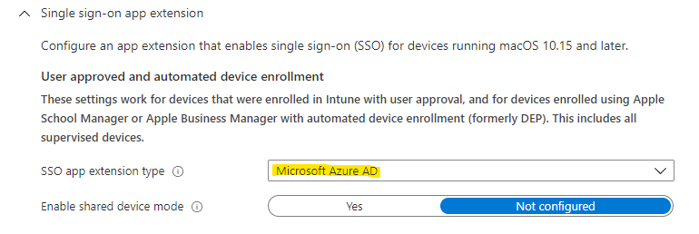

Circa 2 anni fa (Giugno 2021), mi ero divertito a sperimentare una nuova funzionalità che era in preview: il macOS Single Sign-On (SSO) di Azure AD su applicazioni e servizi di Microsoft 365.

⚠️ ***Aggiornamento del 1 Giugno 2023*** Il plug-in di tipo "Microsoft Azure AD" è finalmente in General Availability ed è quindi pronto da usare anche in ambienti di produzione!

Vi starete quindi domandando: "A cosa diamine serve?"

**Questa funzionalità serve ad autenticare voi e il vostro fantastico Mac molto più facilmente ai servizi e alle applicazioni di Microsoft 365 senza ripetuti prompt di inserimento credenziali**, rendendo l’esperienza utente ancora più liscia e senza soluzione di continuità.

**È giusto ricordare che questa estensione non permette il login a livello di dispositivo su macOS**, serve solo per le applicazioni. 

Qui sotto, ad ogni modo, ti lascio alcune risorse:

- il link al mio video in cui ho raccontato e mostrato l'esperienza utente



- una meravigliosa infografica di [Merill Fernando](https://twitter.com/merill), Product Manager in Microsoft (seguite il suo profilo, è davvero una fonte inesauribile di informazioni utili!).


  <iframe src="https://www.linkedin.com/embed/feed/update/urn:li:ugcPost:7066440254492151808" height="811" width="504" frameborder="0" allowfullscreen="" title="Post incorporato"></iframe>


La configurazione, se il Mac è gestito da Intune, richiede che:
- sia installata l’app Company Portal sul Mac
- la versione di sistema operativo sia macOS 1.15 o superiori

Ecco qui tutte le informazioni del caso: 😉

- [Microsoft Enterprise SSO for Apple Devices Is Now Available for Everyone](https://techcommunity.microsoft.com/t5/microsoft-entra-azure-ad-blog/microsoft-enterprise-sso-for-apple-devices-is-now-available-for/ba-p/3827395)
- [Microsoft Enterprise SSO plug-in for Apple devices – Microsoft identity platform | Azure | Microsoft Docs](https://docs.microsoft.com/en-us/azure/active-directory/develop/apple-sso-plugin)
- [Create iOS/iPadOS or macOS device profile with Microsoft Intune – Azure | Microsoft Docs](https://docs.microsoft.com/en-us/mem/intune/configuration/device-features-configure#single-sign-on-app-extension)
- [macOS device feature settings in Microsoft Intune – Azure | Microsoft Docs](https://docs.microsoft.com/en-us/mem/intune/configuration/macos-device-features-settings#single-sign-on-app-extension)

In una conversazione privata che ho avuto qualche tempo fa, ho scritto quanto segue: "... credo che mai prima d’ora ci sia stato un momento dove i prodotti dei due mondi (Microsoft ed Apple) vanno così d’accordo..."

E ne ho ogni giorno di più conferma quando testo funzionalità come il macOS Single Sign-On.
Microsoft sta davvero lavorando a strettissimo contatto con Apple e i risultati si vedono.

E voi, quali misure hai adottato per integrare al meglio macOS all’interno dell’azienda? Vi aspetto nei commenti per parlarne!

Riccardo
