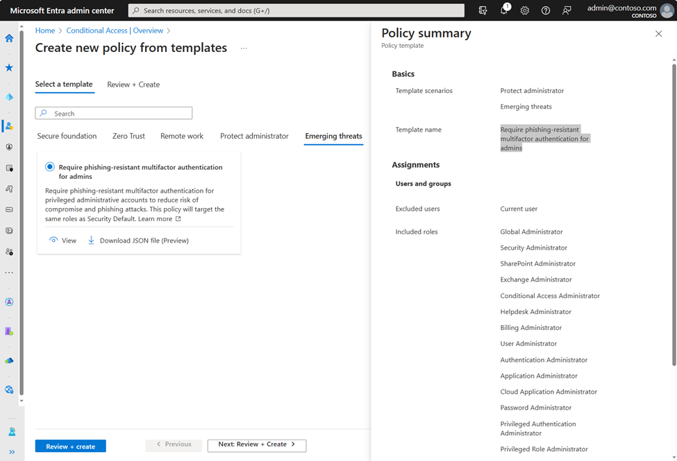
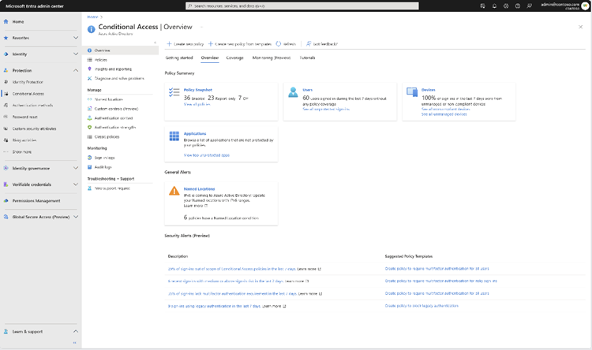

Novità fresca fresca in ambito Microsoft entra ID: finalmente in disponibilità pubblica i template e un'overview tutta nuova. Iniziamo dai template.

## Template
Le policy di acceso condizionale sono uno strumento molto potente, che offre un elevato grado di personalizzazione egranularità. Proprio per questo, a volte, può essere poco intuitivo capire da dove cominciare quando si tratta di implementare una policy particolare per una situazione specifica.

La disponibilità dei template aiuta esattamente in questo senso: fornire strumento pronto all'uso per una situazione specifica, in modo da rendere più semplice l'implementazione di un criterio di accesso condizionale.

I template saranno organizati per scenario (al momento sono cinque) e conterranno configurazioni pronte all'uso a seconda della situazione. Di seguito un esempio di uno scenario "Protect Administrator".

Chiaramente, questo è solo un aiuto e non può sostituire al 100% un'analisi puntuale del proprio ambiente.

Detto questo, passiamo alla prossima novità: una nuova pagina di overview!

## Nuova Overview
La nuova landing page del Conditional Access punta alla nuova panoramica (overview), che contiente informazioni ancora più utili:
- informazioni sui sign-in non protetti da accesso condizionale
- una vista più chiara per individuare i dispositivi non conformi
- le 10 cloud app più accedute senza accesso condizionale
- più altre informazioni sfiziose :)

Un esempio dei sign-in non coperti da conditional access.

## Materiale per approfondire
Per voi che siete assatanati di documentazione, ecco un po' di materiale con una tipica fragranza di fine-estate:
- [Conditional Access Overview and Templates are now Generally Available!](https://techcommunity.microsoft.com/t5/microsoft-entra-azure-ad-blog/conditional-access-overview-and-templates-are-now-generally/ba-p/3888722)
- [Learn more about the Conditional Access overview dashboard](https://aka.ms/CAOverviewDashboard)
- [Learn more about Conditional Access templates](https://aka.ms/ConditionalAccessTemplateDocs)

Come sempre, cercherò di provare quanto prima queste novità, dandovene conto qui sul blog, sul [mio canale YouTube](https://youtube.com/@itspecialistcloud) e sui miei canali social: vi aspetto sui miei profili per parlare insieme di queste novità: pensate possano esservi utili? Se sì, in che modo? A presto!

Il vostro IT Specialist, Riccardo