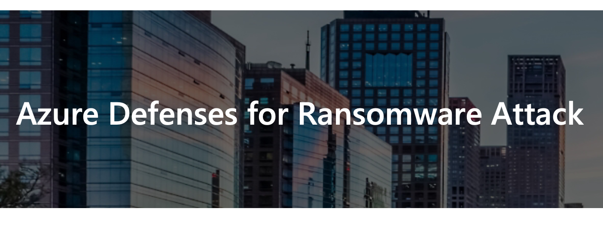

📢 Free-resource-friday! Azure Defenses for Ransomware Attacks. Today, I've gathered for you a highly informative (and free) eBook that discusses the tools available in Azure to counter a Ransomware attack. Almost mandatory reading in these times!

📌 Bonus tip: Don't miss the plethora of links to documents and resources in the "Additional Resources" slide!

📖 Here's where you can download it:  
➡️ [Azure Defenses for Ransomware Attacks](https://azure.microsoft.com/en-us/resources/azure-defenses-for-ransomware-attack/)

Your IT Specialist,
Riccardo