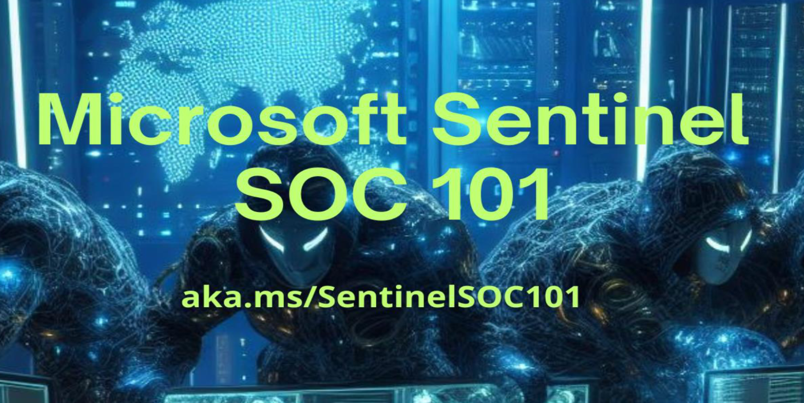

It's true, I neglected "Resource Friday" for a while: why? The spirit of the column was to find for you a, precisely, free "resource" to download or use in the realm of our beloved Microsoft technologies. In recent years, however, the ways in which content is consumed have changed a lot, decisively shifting towards other platforms and formats (video, social media, etc). Moreover, the speed at which product updates and new features arrive, in some cases, quickly renders an eBook obsolete. Those who used to write them prefer other formats and, therefore, overlooking those written by companies that provide eBooks behind a "paywall" or "registration wall," there are fewer and fewer of them.

So, after reflecting for a long time more or less as in the slide below, how to overcome this without distorting or even eliminating this classic Friday post containing useful information?



  <iframe src="https://giphy.com/embed/gEvab1ilmJjA82FaSV" width="480" height="480" frameBorder="0" class="giphy-embed" allowFullScreen></iframe>
<a href="https://giphy.com/gifs/rodneydangerfield-thinking-math-rodney-gEvab1ilmJjA82FaSV">via GIPHY</a>



Simple: I present to you **#LearningFriday**! From now on, not just resources or eBooks to "download" but, simply, a weekly collection of the best and most interesting content on Microsoft Security, Microsoft Entra, Microsoft 365, and everything you're used to following with me. Reading the content of other MVPs and interesting personalities from Microsoft is the best way to get inspired and learn new things. 😉

For now, **#LearningFriday** will continue to have the classic form of a blog post and LinkedIn, but it is not excluded that it may change: the holiday season will bring advice.

Meanwhile, to end the more "classic" form of this column in style, here's a wonderful eBook by [Rod Trent](https://www.linkedin.com/in/rodtrent/) (Senior Program Manager - Cloud Security and AI at Microsoft).

The book is called **Microsoft Sentinel SOC 101**, released and constantly updated on GitHub, and it talks about how Microsoft Sentinel can detect and mitigate some of the most common and impactful cyberattacks.

You can find it (along with other great stuff) here:
- [Content and collateral for the Microsoft Sentinel SOC 101 series](https://github.com/rod-trent/Sentinel-SOC-101)

In particular, each chapter will cover a different type of attack, such as brute force, phishing, malware, cross-site scripting (XSS), supply chain, credential reuse, SQL injection, denial of service (DoS), man-in-the-middle (MitM), keylogger, cryptojacking, or drive-by download. It describes how these attacks work, what their indicators of compromise (IoCs) are, how to configure Microsoft Sentinel to detect them, how to investigate them using its features, and how to respond to them using integrations and automation options.

What can I say, happy reading, and until the next **#LearningFriday**!

Your IT Specialist,
Riccardo