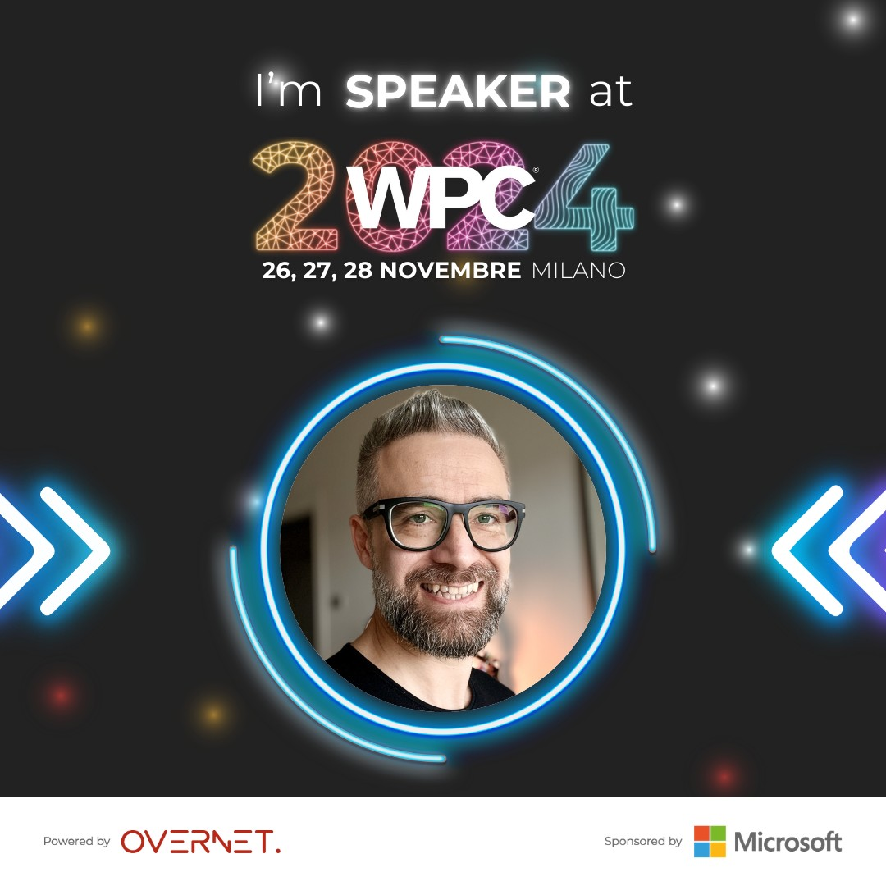

My personal holiday calendar says that after Halloween but before Christmas, there’s at least one more: WPC! 😀  
WPC (November 26-27-28), the most important annual event in the Italian ICT landscape, is just around the corner! 

This year, I’ll be there again as a speaker, with a session that has a bit of a "crossover" flavor: Microsoft Intune and Apple macOS.
Microsoft and Apple—a dualism that used to stir passions but, in my view, no longer has any reason to exist in terms of "opposition."  
In fact... Intune (SPOILER: and now also Entra) ❤️ macOS, and we'll see it together in my session!

For all the agenda details:  
➡️ https://wpc.education

Your IT Specialist,  
Riccardo
