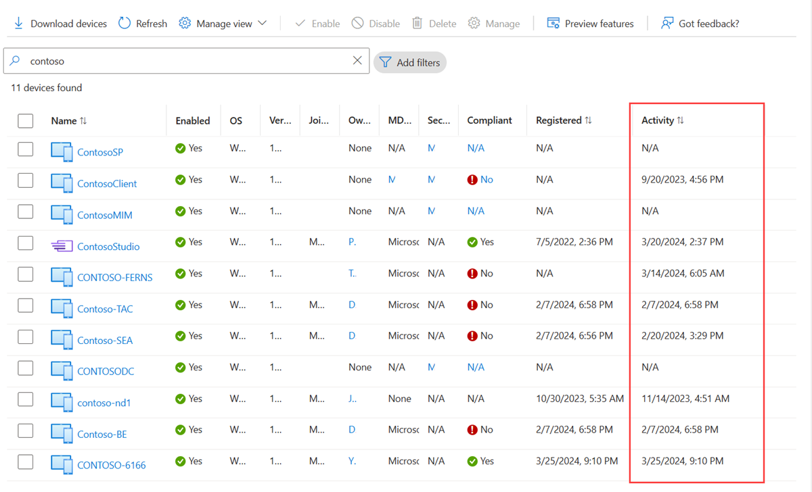

Quick tips for managing inactive/stale devices in Microsoft Intune and Microsoft Entra. While it may seem trivial, I’ve noticed in recent months that this topic is widely felt but at the same time underestimated and poorly managed.  
I could make a video about it, but in the meantime, here are two quick tips.

1️⃣ **Intune** - Use the [Device Cleanup Rules](https://learn.microsoft.com/en-us/mem/intune/remote-actions/devices-wipe#automatically-delete-devices-with-cleanup-rules)

2️⃣ **Entra** - Implement a cleanup flow based on the [Device Activity (ApproximateLastSignInDate attribute)](https://learn.microsoft.com/en-us/entra/identity/devices/manage-stale-devices).

3️⃣ Hybrid Entra Joined devices: implement a cleanup flow in your on-premises Active Directory. Delete unused computer objects or move them outside the OUs synchronized with Entra Connect. This way, the corresponding cloud object in Entra will disappear. The reverse is not true.

How do you approach cleaning up stale objects in Intune and Entra? Let’s discuss it on my social profiles!

Your IT Specialist,  
Riccardo
