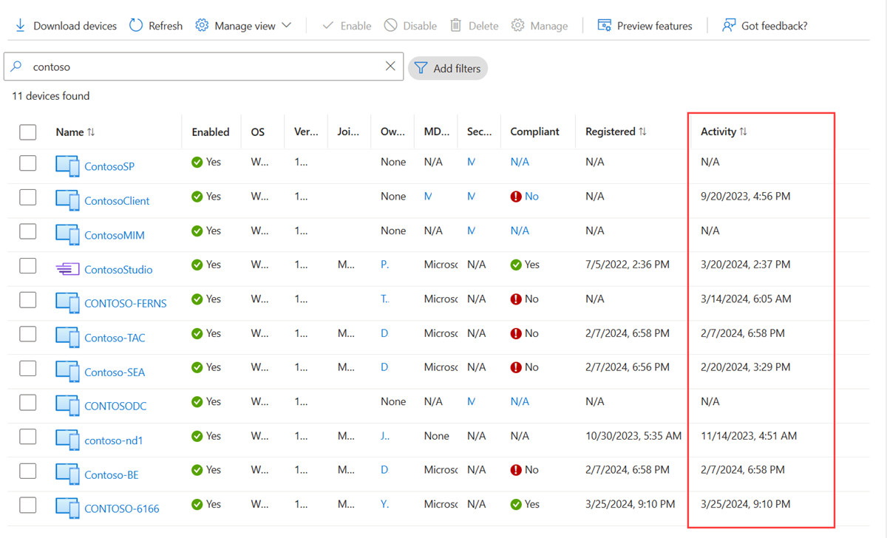

Suggerimenti al volo per gestire i dispositivi inattivi/obsoleti in Microsoft Intune e Microsoft Entra. Pur sembrando banale, in questi mesi, sul campo ho percepito che la questione è molto sentita ma, al tempo stesso, sottovalutata e poco gestita.
Potrei farci un video ma, per intanto, ecco due dritte al volo.

1️⃣ **Intune** - Usate le [Device Cleanup Rules](https://learn.microsoft.com/en-us/mem/intune/remote-actions/devices-wipe#automatically-delete-devices-with-cleanup-rules)

2️⃣ **Entra** - Implementate un flusso di pulizia basato sull'[Activity del dispositivo (attributo ApproximateLastSignInDate)](https://learn.microsoft.com/en-us/entra/identity/devices/manage-stale-devices).

3️⃣ Hybrid Entra Joined devices: implementate un flusso di pulizia su Active Directory on-premises. Cancellate i computer object inutilizzati oppure muoveteli al di fuori delle OU sincronizzate con Entra Connect. In questo modo il corrispettivo oggetto in cloud sparirà da Entra. Non vale il contrario.

E voi come approcciate la pulizia degli oggetti obsoleti su Intune ed Entra? Parliamone insieme sui miei profili social!

Il vostro IT Specialist,  
Riccardo