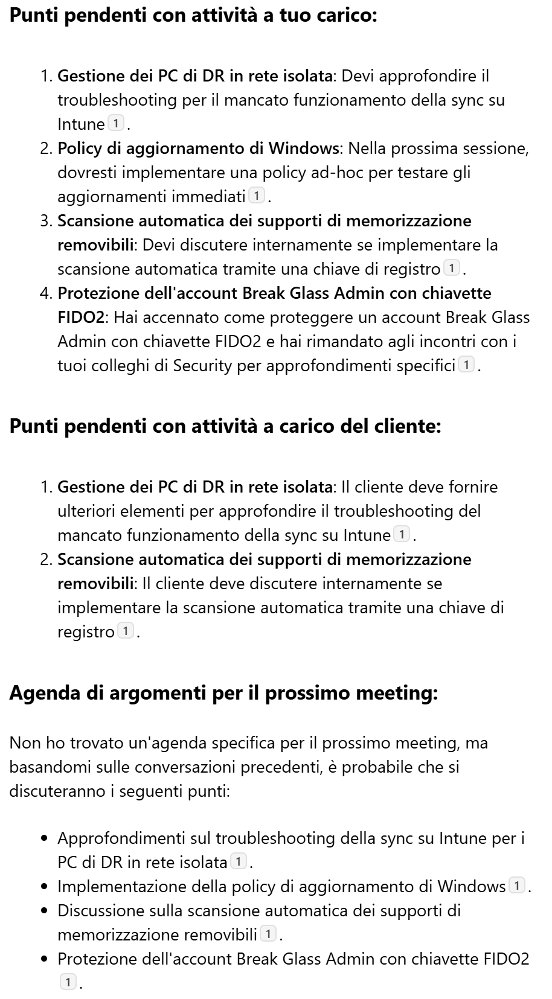

🚨 Microsoft 365 Copilot Quick Tip! Nel mio ruolo attuale lavoro con molti clienti (ne sento fino a 6-8 a settimana). A volte con appuntamenti di poche ore a distanza di un paio di settimane. Non è semplice ricordarsi e appuntarsi sempre in maniera manuale cosa era rimasto in sospeso o un'eventuale agenda per il prossimo incontro, in questa battaglia navale che è il mio calendario. 🤣

✒️ Ecco un prompt semplicissimo che uso in Outlook per rinfrescarmi la memoria quando si avvicina l'incontro successivo con un cliente.

> Analizza tutte le mie conversazioni avute con il cliente *< X - nome per esteso e/o sigla/acronimo >* e dimmi:
> - Quali sono i punti pendenti con attività a mio carico
> - Quali sono i punti pendenti con attività a carico del cliente
> - Se è stata fissata un'agenda di argomenti per il prossimo meeting che ho con loro

➡️ In figura il risultato: niente più buchi di memoria o tempo dedicato a riscrivere N volte tonnellate di appunti su cose già dette: basta quello di cui si è già parlato via mail o nei meeting!

⚠️ Nota: in questo caso specifico ho chiesto a Copilot di eliminare dall'output ogni riferimento al nome dei clienti e alle persone coinvolte perché volevo condividere qui lo screenshot. Ovviamente, potrebbe tornare utile anche farsi ricordare le persone specifiche coinvolte nelle attività!

👍🏻 Spoiler: sto risparmiando un sacco di tempo.

❓ Voi usate altri prompt che vi aiutano a rinfrescare la memoria quando ci sono 1000 cose da fare e ricordare? Fatemi sapre quali! Parliamone insieme nei commenti. A presto! 😊

Il vostro IT Specialist,  
Riccardo