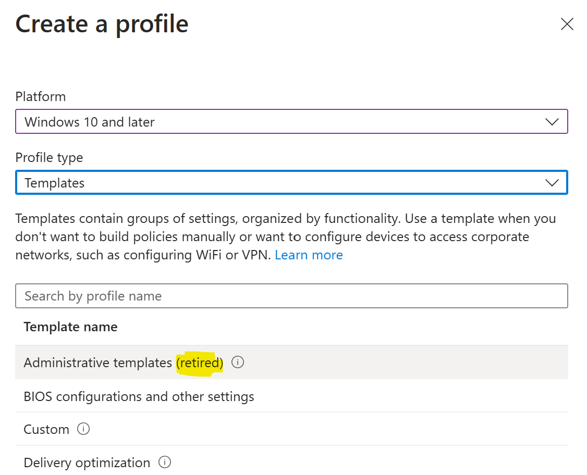

🚨 Aggiornamento Importante! Fine del Supporto per i Modelli Amministrativi nella Creazione di Nuovi Profili di Configurazione 🚨

Con l'ultima release di Intune non sarà più possibile creare nuovi profili di configurazione utilizzando i Administrative Templates tramite

**Devices** > **Configuration** > **Create** > **New policy** > **Windows 10 and later** > **Administrative Templates**

Vedrete un'etichetta (*retired*) accanto ad Administrative Templates e il pulsante Create sarà disattivato. Gli altri modelli continueranno a essere supportati.

💡 Novità: Ora è possibile utilizzare il Settings Catalog per creare nuovi profili di configurazione degli Administrative Templates navigando su

**Devices** > **Configuration** > **Create** > **New policy** > **Windows 10 and later** > **Settings Catalog**

Non ci sono cambiamenti nelle seguenti esperienze dell'interfaccia utente:
- Modifica di un Administrative Template.
- Eliminazione di un Administrative Template esistente.
- Aggiunta, modifica o eliminazione di impostazioni in un Administrative Template esistente.

Per approfondimenti, come sempre, fate riferimento alla documentazione ufficiale.

📃 [Ending support for administrative templates when creating a new configuration profile](https://learn.microsoft.com/en-us/mem/intune/fundamentals/whats-new#ending-support-for-administrative-templates-when-creating-a-new-configuration-profile)

Come vi state comportando in questa situazione? State già usando il Settings Catalog? Parliamone insieme!

Il vostro IT Specialist,  
Riccardo