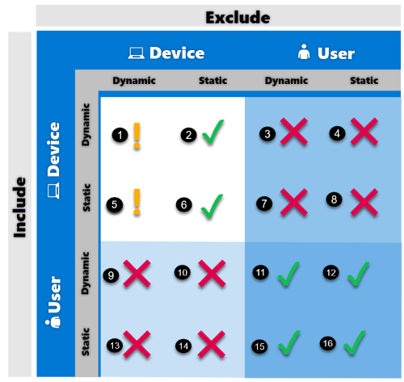

🚀 IT Specialists! Some best practices when assigning policies on Intune.

And save the attached image with the supportability matrix for inclusions and exclusions, printing it in a long paper format to hang on all walls. 😀

📌 **Included or Excluded Groups**: Use these groups as a starting point for assigning policies. The Microsoft Entra group is the limiting group, so use the smallest group scope possible and filters to refine the assignment.

📌 **Static Groups**: Assigned Microsoft Entra groups can be added to Included or Excluded groups. Statically assign pre-registered devices or for ad hoc implementations.

📌 **Dynamic User Groups**: Can be added to Included or Excluded groups.

📌 **Excluded Groups**: Can contain users or devices.

📌 **Dynamic Device Groups**: Can be added to Included groups, but may have latency in population. In latency-sensitive scenarios, use filters to target specific devices and assign policies to user groups.

📌 **Latency-Sensitive Scenarios**: To assign policies to devices as soon as they register, create a filter to target the desired devices and assign the policy with this filter to user groups. Do not assign to device groups.

📌 **Userless Scenarios**: Create a filter to target the desired devices and assign the policy with the filter to the "All devices" group.

📌 **Avoid Dynamic Device Groups in Excluded Groups**: Latency in dynamic group calculation during registration can cause undesirable results, such as unwanted apps and policies being deployed before the excluded group membership is populated.

## Attached documentation
Here is the official document that inspired this post.

📖 [Assign policies in Microsoft Intune](https://learn.microsoft.com/en-us/mem/intune/configuration/device-profile-assign)
