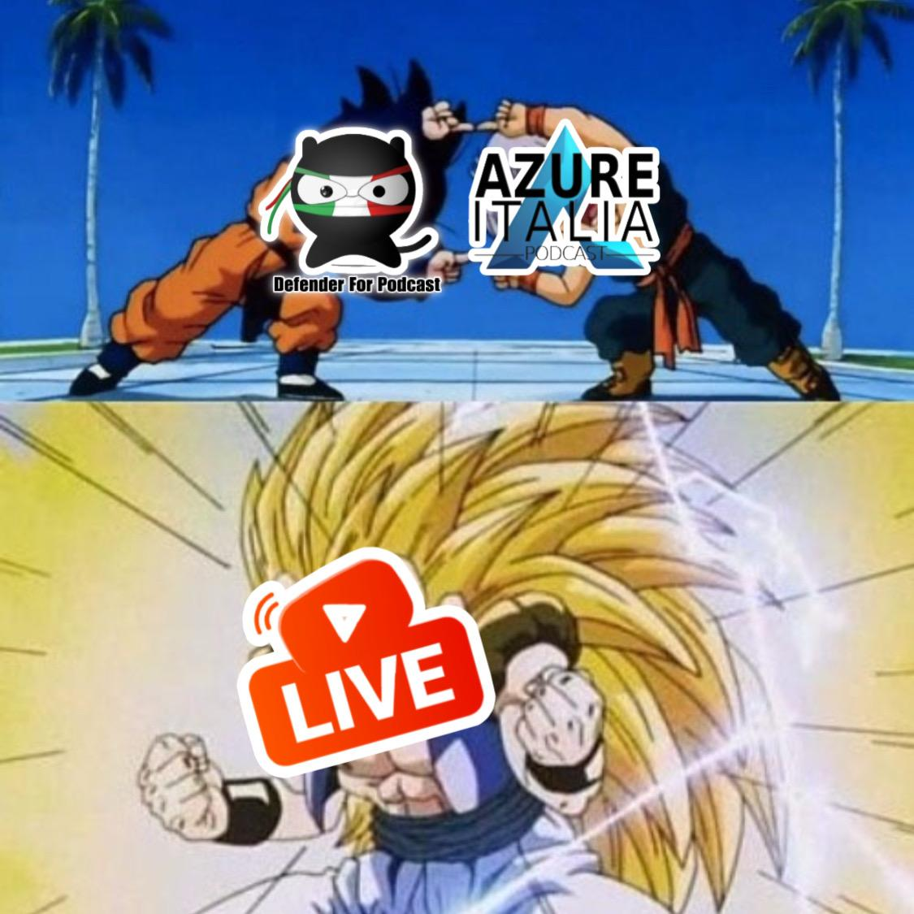

🚨 Questa fusion potrebbe sprigionare un'aura fatale per l'equilibrio dell'Internet! 🤣  
Di quale fusion parlo? Di quella tra Azure Italia Podcast e Defender for Podcast, il podcast ufficiale della comunity Microsoft Security Italian Users Group!

🎙️ Due podcast per una sola live! Esatto, ho detto "Live".  
🗓️ In diretta, per voi, lunedì 10 febbraio a partire dalle 18.00!  
🔴 Live su YouTube e Linkedin!

🔗 Registratevi, condividete l’evento e salvatelo sul calendario!

📺 [Youtube](https://www.youtube.com/live/JpxAUaMTGRw)  
💼 [Linkedin](https://www.linkedin.com/events/azureitaliapodcastintervistadef7292081788040966144/)

🔐 Parleremo di Microsoft Azure e IaaS Security, analizzando come proteggere i propri workloads su Azure a partire dalle Virtual Machines.

Non perdete l'occasione di approfondire le best practice di sicurezza per la vostra infrastruttura cloud! Si potranno fare domande in diretta ed interagire con noi. Stay Tuned 😎

A presto, vi aspettiamo!

Il vostro IT Specialist,  
Riccardo