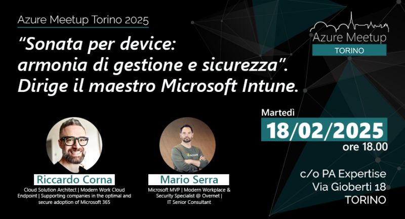

👋🏻 Hi everyone! On Tuesday, February 18, 2025, I will be a speaker at the Azure Meetup in Turin, an event of the local Azure community.

🎉 The event will take place exclusively in person in **Turin**, at the **PA Expertise headquarters** in **Via Gioberti 18**, starting **from 6:00 PM**.

😊 I have been wanting to participate in this meetup for a long time, with the ITS guys, a beer after the session, and a unique atmosphere. Turin is always special!  
Thanks to Alberto Jacomuzzi and the Turin community for the invitation!

ℹ️ [For info and agenda](https://www.meetup.com/meetup-microsoft-azure-torino/events/305493202/?utm_medium=referral&utm_campaign=share-btn_savedevents_share_modal&utm_source=linkedin) 👇🏻 👇🏻

Your IT Specialist,  
Riccardo
