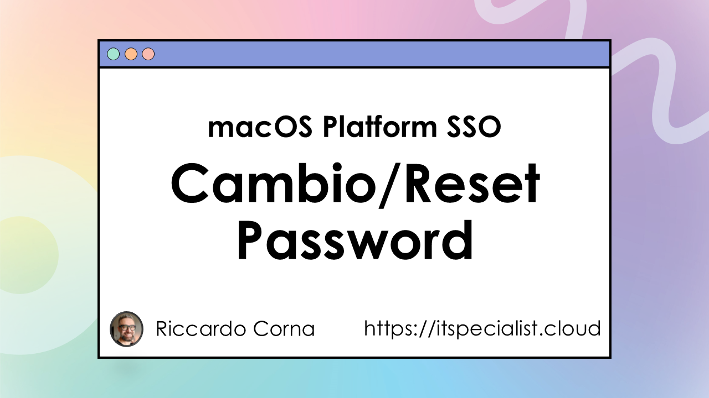
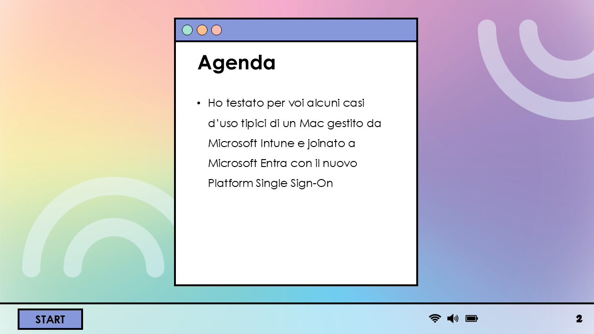
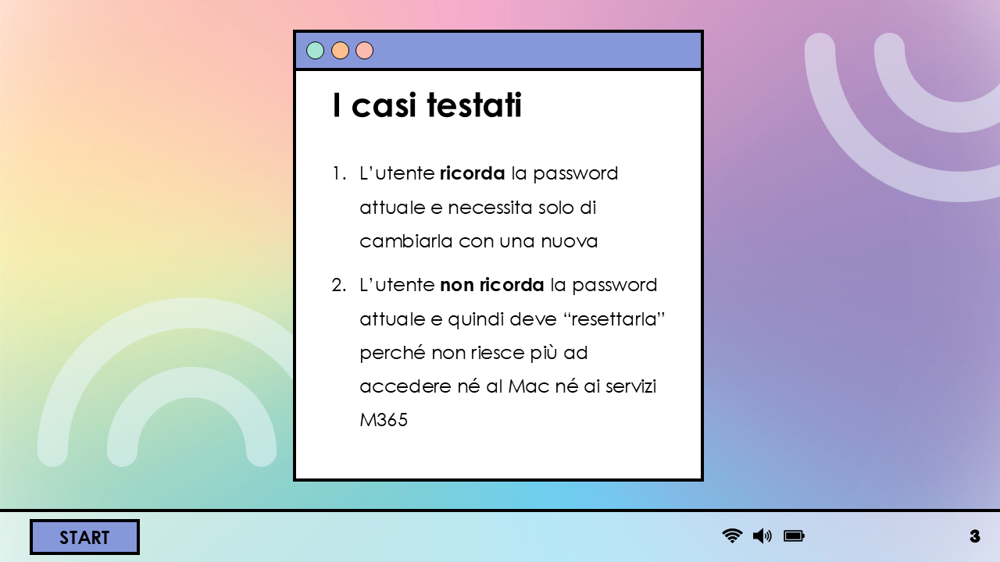
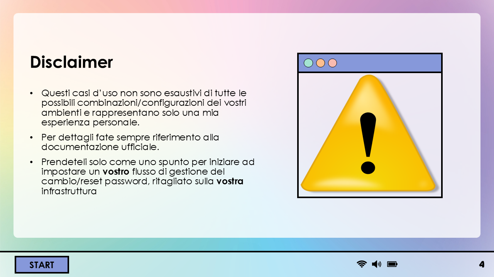
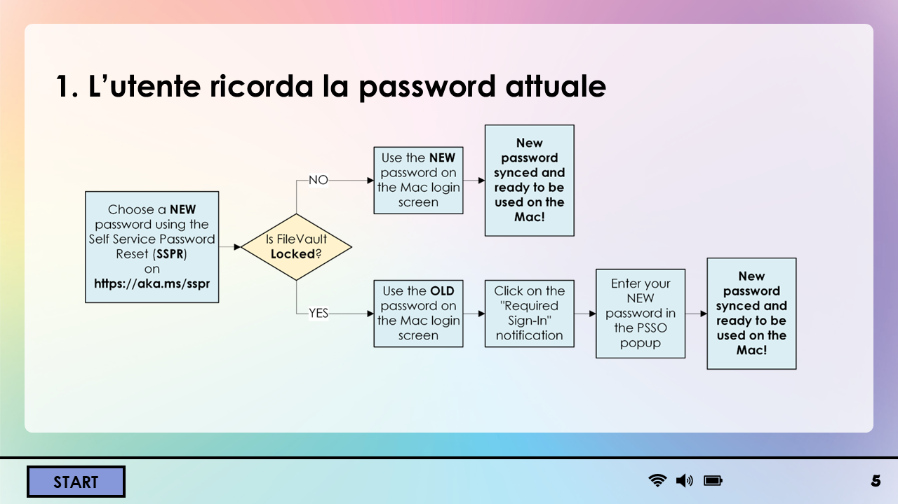
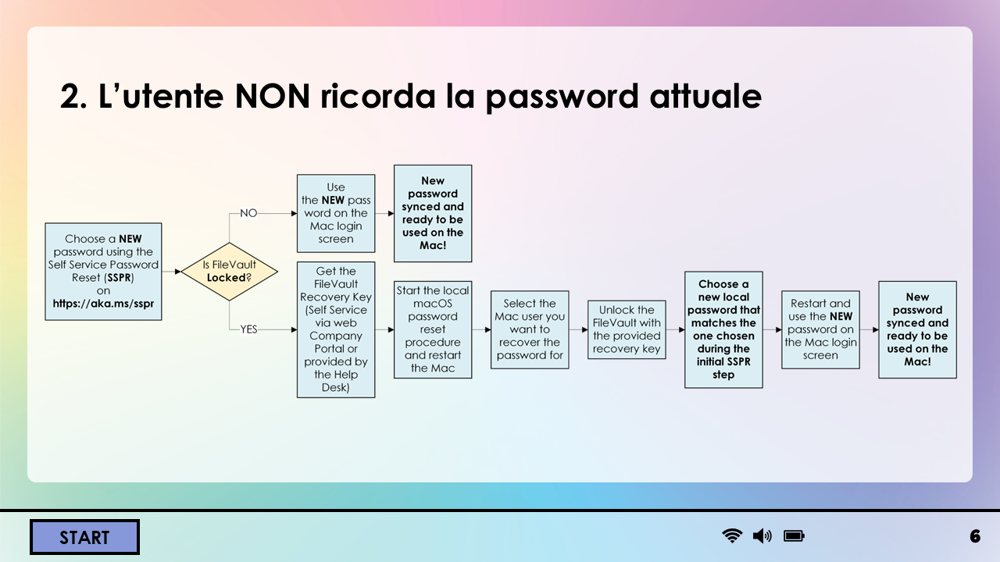
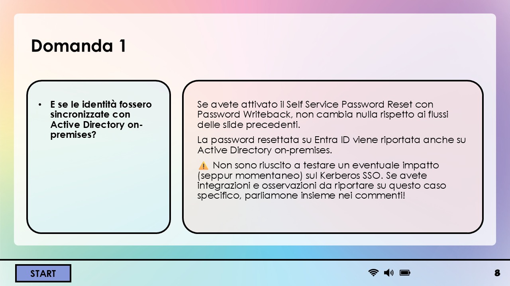
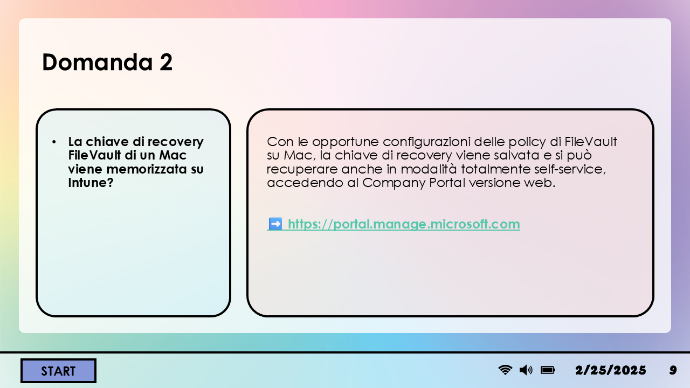
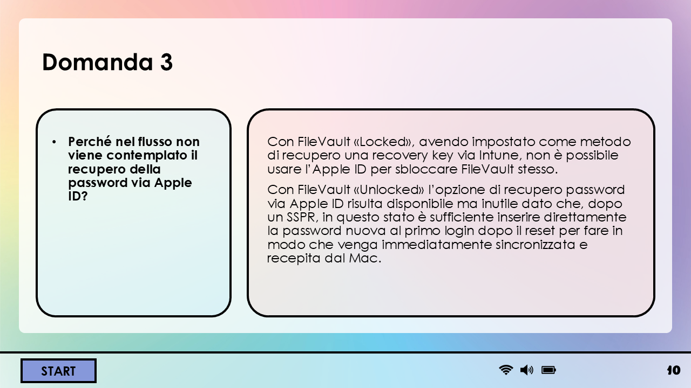

🚀 IT Specialists! Many have asked me for specific details about how Platform Single Sign-On (PSSO) works on macOS when you need to change your password or reset it because you've forgotten it.

✒️ I've done MANY tests and, instead of a video, this time I dared to create a flowchart that should help visualize and better absorb the process.

Three fundamental things before starting.

1️⃣ The basis of everything, for proper functioning and the simplest possible flow, is having configured the Self Service Password Reset (SSPR) on Microsoft Entra. Without that, everything becomes more complicated. It all starts there.

2️⃣ It is crucial to have configured the Intune policy for FileVault and verified that the recovery keys are correctly saved on Intune.

3️⃣ The main determinant in the user experience of changing/recovering the password is whether FileVault, at the time of the password reset on Entra, is "locked" or "unlocked". In other words, if you have turned on or restarted the Mac after doing SSPR, FileVault will be "locked" and you will have a different experience compared to doing everything on a Mac that was simply in "sleep" or "lock screen" mode while on.

⚠️ Disclaimer: my tests are done in a lab environment, so I cannot replicate exactly all the possible conditions found in a production environment. Take these results only as a starting point to set up your own password change/reset flow, tailored to your infrastructure.

Here are the results of my tests and a proposed flow for changing or resetting the password, even if the user doesn't remember it!

          

📝 Final note: remember that, at the moment, macOS PSSO via Intune is still in Preview, so the features are not yet final.

📄Official documentation 👇🏻

🔗 [Password Change](https://learn.microsoft.com/en-us/entra/identity/devices/troubleshoot-macos-platform-single-sign-on-extension?tabs=macOS14#how-can-i-change-my-password-when-using-platform-sso)  
🔗 [Forgotten Password](https://learn.microsoft.com/en-us/entra/identity/devices/troubleshoot-macos-platform-single-sign-on-extension?tabs=macOS14#what-should-i-do-if-i-forget-my-password)

If you are already using PSSO, have you tested the password change or reset? If you have integrations, observations, let's discuss them in the comments!

Your IT Specialist,  
Riccardo