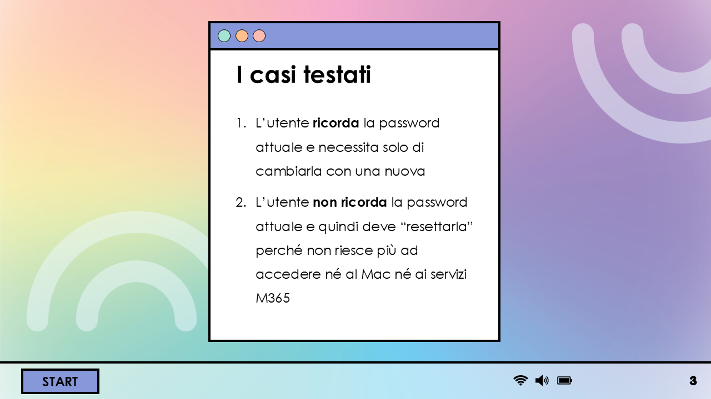
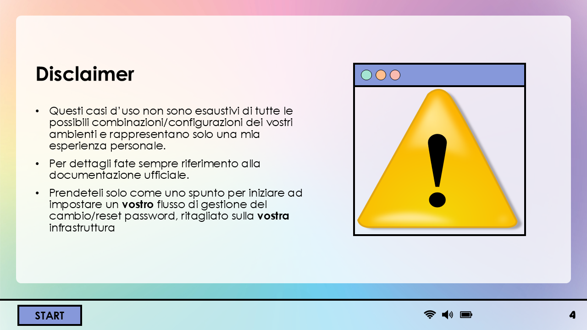
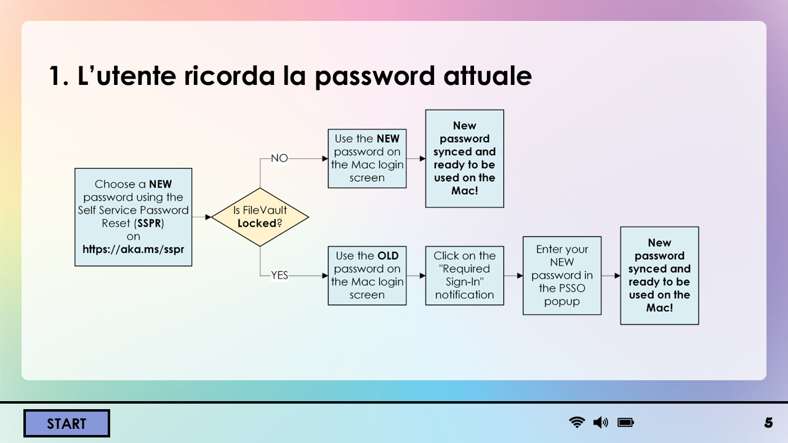
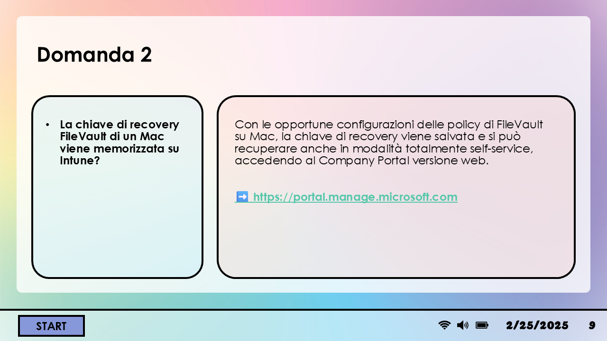
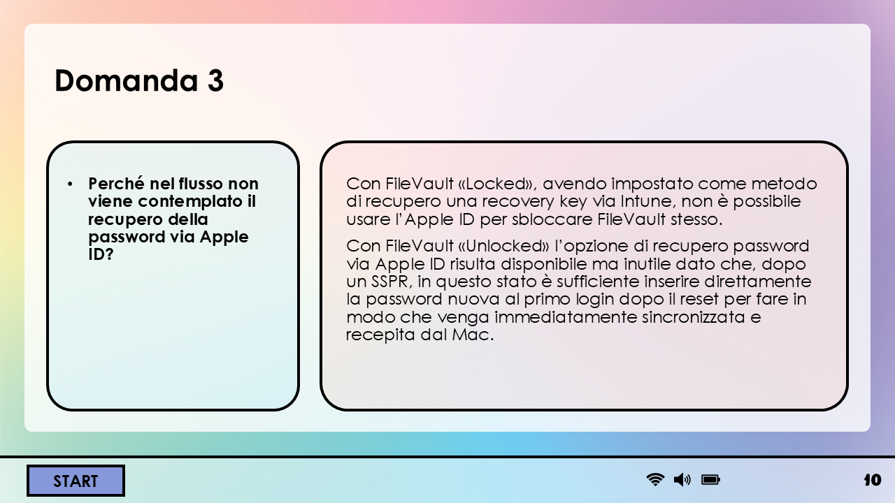

🚀 Specialisti IT! In molti mi hanno chiesto dettagli specifici riguardo al funzionamento del Platform Single Sign-On (PSSO) su macOS nel momento in cui si debba cambiare password o, per qualche motivo, resettare perché la si è dimenticata.

✒️ Ho fatto TANTI test e, anziché un video, questa volta mi sono azzardato a creare un diagramma di flusso che dovrebbe aiutare a visualizzare e assorbire meglio il processo.

Tre cose fondamentali prima di partire.

1️⃣ La base di tutto, per un funzionamento corretto e un flusso il più semplice possibile, è aver configurato il Self Service Password Reset (SSPR) su Microsoft Entra. Senza quello, diventa tutto più complesso. Tutto parte da lì.

2️⃣ Importantissimo aver configurato la policy Intune di FileVault e aver verificato che le chiavi di recovery vengano salvate correttamente su Intune.

3️⃣ La discriminante principale nell’esperienza utente di cambiamento/recupero della password è se il FileVault, al momento del reset password su Entra, sia “locked” o “unlocked”. In altre parole, se avete acceso o riavviato il Mac dopo aver fatto SSPR, il FileVault sarà “locked” e quindi avrete un’esperienza diversa rispetto a fare il tutto su un Mac che era semplicemente in “sleep” o in “lock screen” da acceso.

⚠️ Disclaimer: i miei sono test fatti in ambiente di laboratorio e quindi non mi è possibile replicare esattamente tutte le possibili condizioni che si trovano in un ambiente di produzione. Prendete questi risultati solo come uno spunto per iniziare ad impostare un vostro flusso di gestione del cambio/reset password, ritagliato sulla vostra infrastruttura.

Ecco i risultati dei miei test e un'ipotesi di flusso di cambio o reset password, anche in caso l'utente non se la ricordi!

          

📝 Ultimissima nota: ricordate che, al momento, macOS PSSO via Intune è pur sempre in stato di Preview e, quindi, le funzionalità non sono ancora quelle definitive.

📄Documentazione ufficiale 👇🏻

🔗 [Cambio password](https://learn.microsoft.com/en-us/entra/identity/devices/troubleshoot-macos-platform-single-sign-on-extension?tabs=macOS14#how-can-i-change-my-password-when-using-platform-sso)  
🔗 [Password dimenticata](https://learn.microsoft.com/en-us/entra/identity/devices/troubleshoot-macos-platform-single-sign-on-extension?tabs=macOS14#what-should-i-do-if-i-forget-my-password)

Se state già usando PSSO, avete già testato il cambio o reset password? Se avete integrazioni, osservazioni, parliamone insieme nei commenti!

Il vostro IT Specialist,  
Riccardo