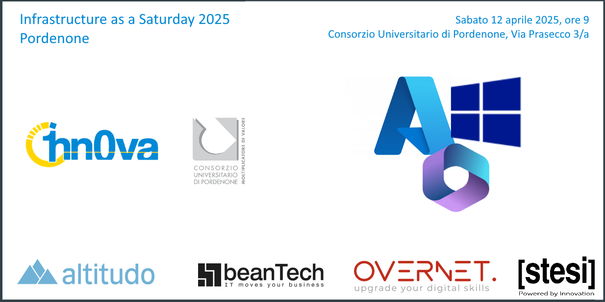

I'll start with the key information, so those in a hurry won't waste time. But if you have a few minutes, read everything because it's important to me.
First of all... I announce that I will be a speaker at Infrastructure as a Saturday 2025 Pordenone on the upcoming April 12th!

**All the details here** 👇🏻  
📅 **Saturday, April 12** from 9.00 AM to 6.00 PM  
📍 **Consorzio Universitario di Pordenone, via Prasecco 3/A** 
ℹ️ **Agenda and tickets** 👇🏻  
➡️ [Infrastructure as a Saturday 2025 Pordenone](https://iaasat2025pn.1nn0va.it/)

I will talk about macOS and Intune and, together with other I-N-C-R-E-D-I-B-L-E speakers, it will be an amazing day of training, totally FREE. An opportunity like few others among Italian events. Take a look at the agenda and you'll see.

And now, as announced, a personal digression. 😊

I'll take my time but it's necessary. It was the year 2019 and I attended (as a spectator) for the first time a community event: it was in Pordenone, one of the many wonderful @1nn0va Saturdays that Marco Parenzan has organized over the years.

I remember the sessions by Marco Obinu and Daniele Scrivano (at that time we were all colleagues) and another beautiful one by Giuliano Latini (a use of KQL on IaaS infrastructure in Azure that was light years ahead for its time, amazing) and I also remember that, precisely that Saturday, something clicked in my head:

> "I want to be the speaker who shares experiences and technologies."

I was technically ready but not ready as a "speaker". I didn't think I was capable of it. In fact, I was convinced not only that I wasn't capable but also that I wasn't cut out for it at all.  
ZERO. Complete self-sabotage.  
The mere idea of speaking "live" even in front of a few people paralyzed me.

But... thanks to that seed planted during that late 2019 1nn0v4 Saturday, I started creating content more consistently on my blog and LinkedIn, driven by a strong push that has lasted over 6 years and continues (albeit differently). Take a look at the frequency of blog posts pre and post-2019 and you'll understand what I'm talking about. 🤣

Thanks to this push, I met Michele Sensalari and took my first steps as a speaker at events, reaching the point where I couldn't wait for the next event, the next community meetup, the next speech.  
Curious for someone who was paralyzed at the idea of speaking in front of an audience. 😨

Well, on Saturday April 12th, 2025 I'll be in one of those classrooms in Pordenone.  
No longer as a spectator.  
And so, the circle closes: Pordenone will be truly special for me.😊

Thanks from the bottom of my heart to Marco Parenzan and Michele Sensalari: it's partly your fault if I've been clogging up others' LinkedIn timelines for years. 😆

For everyone else... we'll see you in Pordenone! YOU ROCK... see you soon! 👍🏻

Your IT Specialist,
Riccardo