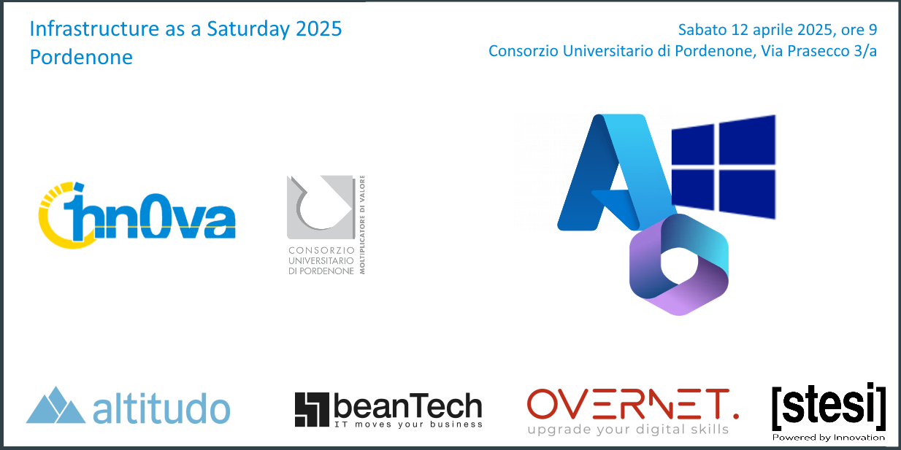

Parto subito con le informazioni salienti, così chi ha fretta non perde tempo. Ma, se avete qualche minuto, leggete tutto perché ci tengo.
Intanto... vi annuncio che sarò speaker all'Infrastructure as a Saturday 2025 Pordenone del prossimo 12 Aprile!

**Tutti i dettagli qui** 👇🏻 
📅 **Sabato 12 Aprile** dalle 9.00 alle 18.00  
📍 **Consorzio Universitario di Pordenone, via Prasecco 3/A** 
ℹ️ **Agenda e biglietti** 👇🏻 
➡️ [Infrastructure as a Saturday 2025 Pordenone](https://iaasat2025pn.1nn0va.it/)

Parlerò di macOS e Intune e, insieme ad altri speaker I-N-C-R-E-D-I-B-I-L-I, sarà una giornata pazzesca di formazione, totalmente GRATUITA. Un'opportunità come ce ne sono poche, tra gli eventi Italiani. Date un occhio all'agenda e ve ne renderete conto.

E ora, come annunciato, una digressione personale. 😊

La prendo lunga ma è necessario. Correva l'anno 2019 e io assistevo (da spettatore) per la prima volta ad un evento di community: era a Pordenone, uno dei tantissimi e meravigliosi @1nn0va Saturday che Marco Parenzan ha organizzato negli anni.

Ricordo le sessioni di Marco Obinu e Daniele Scrivano (al tempo eravamo tutti e 3 colleghi) e un'altra bellissima di Giuliano Latini (un utilizzo di KQL su infrastruttura IaaS in Azure che era avanti anni luce per il tempo, pazzesca) e ricordo anche che, proprio quel sabato, mi è scattato qualcosa in testa:

> "Vorrei essere io lo speaker che racconta esperienze e tecnologie".

Ero pronto tecnicamente ma non ero pronto come "speaker". Non pensavo di esserne capace, anzi, ero convinto non solo di non esserne capace ma addirittura di non essere per nulla tagliato a farlo.  
ZERO. Auto-sabotaggio completo.  
La sola idea di parlare "live" anche davanti a poche persone mi paralizzava.

Ma... proprio grazie a quel tarlo che mi si è insinuato durante quell'1nn0v4 Saturday di fine 2019, ho iniziato a creare contenuti in maniera più costante sul blog e su Linkedin, in una spinta fortissima che ormai dura oltre 6 anni e che (anche se in modo differente) continua. Date un occhio alla frequenza dei blog post pre e post 2019 e capirete di cosa parlo. 🤣

Grazie a questa spinta, ho conosciuto Michele Sensalari e ho iniziato a muovere i primi passi come speaker agli eventi, arrivando al punto di non vedere l'ora del prossimo evento, del prossimo meetup di community, del prossimo speech.  
Curioso per uno che era paralizzato all'idea di parlare davanti ad un pubblico. 😨

Bene, sabato 12 Aprile 2025 sarò in una di quelle aule, a Pordenone.  
Non più come spettatore.  
E, quindi, il cerchio si chiude: Pordenone sarà davvero speciale per me.😊

Grazie di cuore a Marco Parenzan e Michele Sensalari: è anche un po' colpa vostra se da anni intaso le timeline Linkedin altrui. 😆

Per tutti gli altri... vi aspettiamo a Pordenone! MITICI... a presto! 👍🏻

Il vostro IT Specialist,  
Riccardo