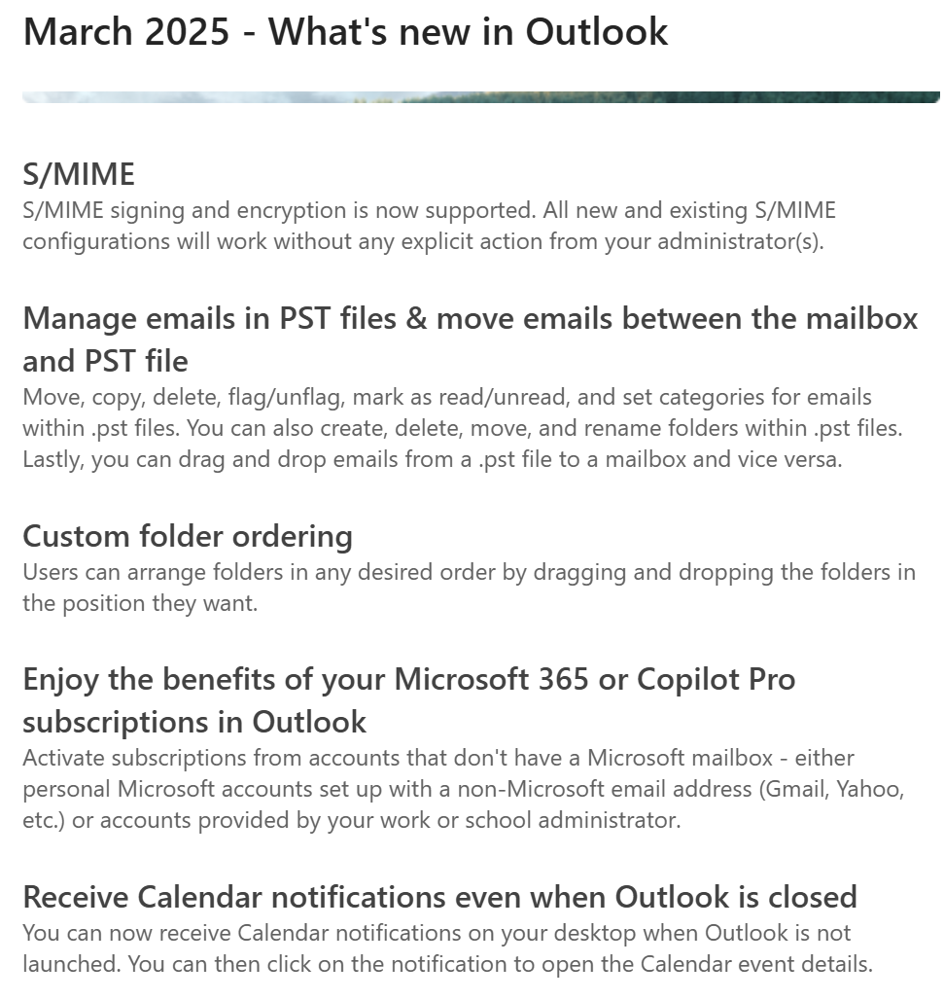

🚨 #ModernWorkNews - I know the new Outlook is a highly divisive topic, but for those already using it, March 2025 brings some interesting new features: here they are.

I don't think they are available to everyone yet, but they will be soon!

📌 To stay updated on Outlook news:  
🔗 [Release notes for Outlook for Windows (new)](https://learn.microsoft.com/en-us/officeupdates/release-notes-outlook-new)

Your IT Specialist,  
Riccardo