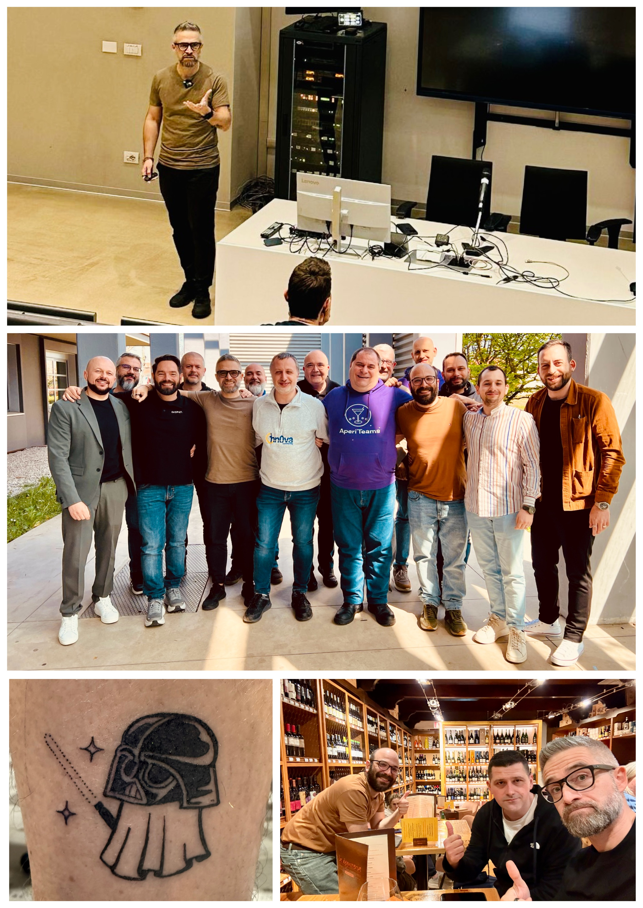

I knew that Infrastructure as a Saturday 2025 in Pordenone would be special, and it was.

Meeting new people, exchanging ideas with other speakers, planning new initiatives, and saying goodbye until the next event is something I will never tire of.

So a huge thank you to Marco Parenzan for inviting me and to all the people who made this day special, which I am sure will become a regular and recurring event in our field.

P.S.: In front of the hotel where we stayed, there was a mysterious "Tattoo & Motors Convention"... let's just say I took advantage of it. I definitely bring back a memory from Pordenone... 🤣

Your IT Specialist,  
Riccardo