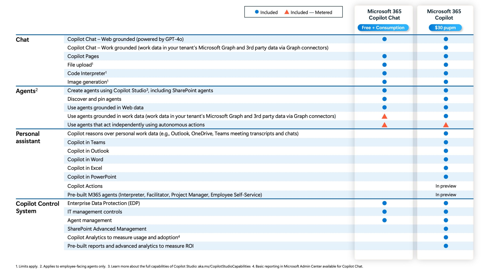

Hello IT specialists! Today we’re diving into a hot topic: **Microsoft 365 Copilot Chat** and how we can control its rollout using **Microsoft Intune**. This article is an in-depth guide, so get ready for a slightly longer read than usual. But it’s worth it — the topic affects pretty much anyone with a Microsoft 365 license.

## Video
You’ll find the full video below, or you can keep reading the article.



## What is Microsoft 365 Copilot Chat?

Microsoft 365 Copilot Chat is a new level of the Copilot tools offering, bringing chat functionality into most Microsoft 365 license plans. In addition to chat, there are other features such as pay-as-you-go agents. For more details on which license plans include Copilot Chat and an overview of the differences from a standard Copilot license, I’ve included some useful links at the end of this article.

➡️ [Attached Documentation](#attached-documentation)

## Using Microsoft Intune to Pin Copilot Chat

The focus of this article is how to use Microsoft Intune to manage the pinning of Microsoft 365 Copilot Chat to the Windows taskbar and navigation bar — all in a gradual and controlled manner. Pinning is enabled by default for users with a full Copilot license. But what do we mean by pinning? It refers to the action of placing the Microsoft 365 Copilot icon on the navigation bar in the portal and the Windows taskbar.

## Configuring the Intune Policy

To pin to the Windows taskbar, we need to configure an Intune policy. First, we must retrieve the app identifier using a simple PowerShell command.



Once we have the identifier, we can create the policy to pin the icon to the taskbar.



After creating the policy, we can see the result: the icon is pinned to the taskbar — the first part of the pinning is done. Notice, however, that it’s not yet pinned to the navigation bar: we’ll see how to do that shortly!



## Managing Pinning on the Navigation Bar

Now let’s look at how to manage pinning on the navigation bar. We’ll use specific app policies, but first, let’s look at the global tenant-level policy and what happens when we save it in the Microsoft 365 admin portal. In this case, I globally disabled pinning to allow a gradual rollout.



See that? Saving the setting from the Microsoft 365 admin panel generated a tenant-wide policy — let’s see what it looks like.



Once this global policy is created, disabling pinning for everyone, we can then create a policy that enables pinning for a specific user group, which we can populate gradually.



However, be careful: to make sure our specific policy takes precedence over the one that disables everything, we need to tweak the priority — here’s how.



Perfect, we’re good to go — let’s see what happened on our Windows client!



The Navigation Bar has also been pinned! 🥳

## Attached Documentation
Here’s all the documentation I reference in the video.

### Comparison Table Between Microsoft 365 Copilot Chat and Microsoft Copilot

### Other Useful Documentation
📌 [Manage Microsoft 365 Copilot Chat](https://learn.microsoft.com/en-us/copilot/manage)  
📌 [Configure the applications pinned to the taskbar](https://learn.microsoft.com/en-us/windows/configuration/taskbar/pinned-apps?tabs=intune&pivots=windows-11)  
📌 [Find the Application User Model ID of an installed app](https://learn.microsoft.com/en-us/windows/configuration/store/find-aumid?tabs=ps%2Cexplorer&pivots=windows-11)  
📌 [Policies to manage the Copilot key](https://learn.microsoft.com/en-us/windows/client-management/manage-windows-copilot#policies-to-manage-the-copilot-key)

## Conclusion



🚨 WARNING: Managing navigation bar pinning in this way is suitable only for an initial phase, like a POC. Once the experience has been validated, and training and communication materials are ready, the recommendation is to enable pinning for everyone directly from the M365 admin panel!



This way, we can roll out Copilot Chat gradually. The idea could be to create an activation calendar where user batches are enabled for a POC, alongside a communication and training campaign on how to use the tool.

Can we do more with these policies for Copilot? Yes, using additional app policies or the settings catalog for Edge settings. For instance, we can also map the physical Copilot key on Copilot+ PCs via Intune.  
So, where are you at with your Microsoft 365 Copilot Chat rollout? Let’s talk about it in the comments.

Thanks for reading to the end. For more content, check out my blog at itspecialist.cloud. See you soon, legends!

Your IT Specialist,  
Riccardo
